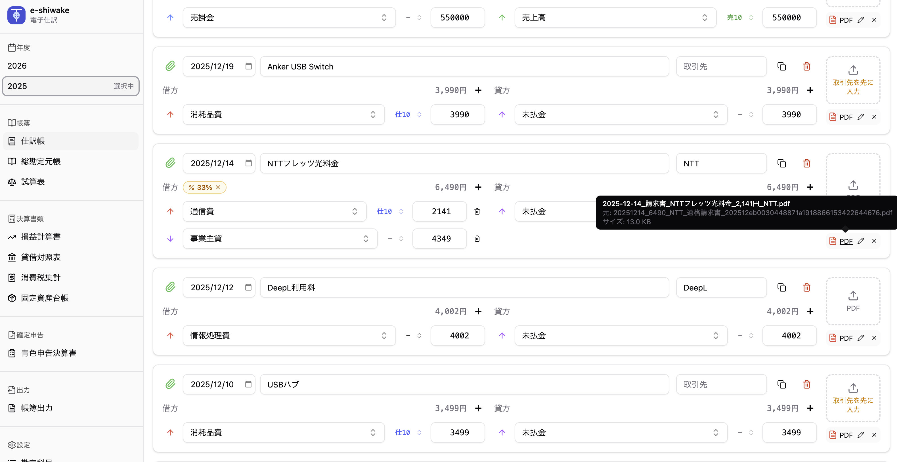

# e-shiwake（電子仕訳）

フリーランス・個人事業主向けの仕訳帳 + 証憑管理 PWAアプリ

[**利用はこちら**](https://shuji-bonji.github.io/e-shiwake/)で提供してます。👉 https://shuji-bonji.github.io/e-shiwake/

個人事業主になったので、自身が必要に迫られて作りました。=°ω°=



## 特徴

- **ローカルファースト**: サーバー不要、IndexedDB にデータ保存
- **電帳法対応**: 日本の電子帳簿保存法の検索要件を満たす
- **証憑管理**: PDF を仕訳に紐付け、自動リネームして保存
- **PWA**: オフライン動作、インストール可能
- **複合仕訳対応**: 家事按分・源泉徴収など複数行の仕訳に対応
- **全年度横断検索**: 摘要、取引先、勘定科目、金額、日付で検索可能
- **帳簿機能**: 総勘定元帳、試算表、損益計算書、貸借対照表、消費税集計
- **帳簿出力**: 複数帳簿の一括印刷、CSV ZIP出力
- **固定資産台帳**: 減価償却シミュレーション、定額法・定率法対応
- **青色申告決算書**: 4ページプレビュー、印刷/CSV出力
- **家事按分**: 按分対象科目の自動検出と金額自動計算
- **請求書管理**: 請求書の作成・編集・印刷、売掛金/入金仕訳の自動生成

## ターゲットユーザー

- 日本のフリーランス・個人事業主
- 確定申告を自分で行う人
- クラウド会計の月額課金を避けたい人

## 技術スタック

- **フレームワーク**: SvelteKit 2 + Svelte 5
- **言語**: TypeScript
- **UI**: shadcn-svelte + Tailwind CSS v4
- **データ保存**: IndexedDB（Dexie.js）
- **ファイル操作**: File System Access API（デスクトップ）
- **PWA**: Service Worker + Web App Manifest
- **テスト**: Vitest

## セットアップ

```sh
# 依存関係のインストール
npm install

# 開発サーバーの起動
npm run dev

# ブラウザで自動的に開く場合
npm run dev -- --open
```

## スクリプト

```sh
# 開発サーバー
npm run dev

# ビルド
npm run build

# ビルドのプレビュー
npm run preview

# 型チェック
npm run check

# Lint
npm run lint

# ユニットテスト
npm test

# テスト（ウォッチモード）
npm run test:unit
```

## 機能

### 実装済み

**Phase 1: MVP + Phase 1.5: PWA & UX強化**

- サイドバーレイアウト
- 年度管理（選択 / フィルタリング）
- 仕訳 CRUD（複合仕訳対応、インライン編集）
- 消費税区分（課税売上/仕入 10%/8%、非課税、不課税、対象外）
- 勘定科目マスタ（初期データ込み）
- 勘定科目管理ページ（追加/編集/削除）
- 取引先オートコンプリート
- PDF 紐付け + 自動リネーム
- 証跡ステータス管理
- IndexedDB 保存
- JSON / CSV エクスポート
- 証憑ダウンロード（IndexedDB モード）
- JSON インポート
- 年度データ削除（2段階確認）
- ダークモード対応
- PWA 対応（オフライン動作、インストール可能）
- ストレージモード切替（ローカルフォルダ / ブラウザ保存）
- 証憑マイグレーション機能
- 完全バックアップ（ZIP: JSON + PDF）
- ZIPインポート（証憑復元対応）
- 仕訳検索（全年度横断、複数条件AND検索）
- 仕訳コピー機能

**Phase 2: 帳簿機能**

- 総勘定元帳（科目別取引履歴、残高推移、CSV出力、印刷/PDF保存）
- 試算表（合計残高試算表/残高試算表、貸借一致チェック、CSV出力、印刷/PDF保存）
- 家事按分（按分対象科目の自動検出、金額変更時の自動再計算）
- 勘定科目のデフォルト消費税区分設定（既存仕訳の一括更新対応）

**Phase 3: 確定申告対応**

- 損益計算書（売上総利益、営業利益、当期純利益、CSV出力、印刷/PDF保存）
- 貸借対照表（流動/固定資産・負債、純資産、貸借一致チェック、CSV出力、印刷/PDF保存）
- 消費税集計（課税売上/仕入、納付税額計算、免税・簡易課税判定、CSV出力）
- 帳簿出力（複数帳簿の一括印刷、CSV ZIP出力）
- 固定資産台帳（CRUD、減価償却シミュレーション、定額法・定率法対応、CSV出力）
- 青色申告決算書（4ページプレビュー、事業者情報設定、印刷/CSV出力）

**Phase 4: 請求書機能**

- 請求書一覧（年度別、ステータスフィルター）
- 請求書作成・編集（自動採番、明細行、税率別集計、自動保存）
- 請求書コピー（既存の請求書を複製して新規作成）
- 取引先管理（CRUD）
- 売掛金仕訳の自動生成（請求書から）
- 入金仕訳の自動生成（入金日指定）
- 請求書印刷・PDF保存

### 今後の予定

- i18n対応（多言語化）

## 電帳法対応

### 検索要件（必須 3 項目）

1. **取引年月日**: 仕訳の日付フィールド
2. **取引金額**: 借方/貸方金額
3. **取引先名**: 取引先フィールド

### ファイル命名規則

証憑ファイルは以下の形式で自動リネームされます。

```
{書類の日付}_{種類}_{摘要}_{金額}円_{取引先名}.pdf
```

例：

```
2024-01-15_領収書_USBケーブル購入_3,980円_Amazon.pdf
2024-01-15_請求書発行_売掛金計上 INV-2024-0001_100,000円_クライアントA.pdf
2024-01-15_請求書_サーバー利用料_10,000円_AWS.pdf
2024-01-15_契約書_業務委託契約_0円_取引先A.pdf
```

## 仕訳検索

仕訳帳画面の検索ボックスから、**全年度を対象に**仕訳を検索できます。

### 検索できる項目

| 入力例       | 検索対象     | 説明                   |
| ------------ | ------------ | ---------------------- |
| `Amazon`     | 摘要・取引先 | テキスト部分一致       |
| `消耗品費`   | 勘定科目     | 科目名の前方一致       |
| `10000`      | 金額         | 完全一致               |
| `10,000`     | 金額         | カンマ付き金額も可     |
| `2025-01`    | 年月         | その月の仕訳を表示     |
| `12月`       | 月           | 全年度の12月の仕訳     |
| `2025-01-15` | 日付         | 特定の日付             |
| `10/13`      | 月日         | 全年度の10月13日の仕訳 |

### 複数条件の検索（AND検索）

スペースで区切って複数の条件を入力すると、すべてに一致する仕訳が表示されます。

- `Amazon 12月` → Amazonの12月の仕訳
- `消耗品費 10000` → 消耗品費で1万円の仕訳

## データ保存

### デスクトップ（Chrome, Edge）

File System Access API を使用して、ユーザーが選択したディレクトリに直接保存。

### iPad / モバイル

IndexedDB に Blob として保存。定期的なエクスポートを推奨。

## ページ構成

```
/                           仕訳帳（ホーム）
├── /ledger                 総勘定元帳
├── /trial-balance          試算表
├── /profit-loss            損益計算書
├── /balance-sheet          貸借対照表
├── /tax-summary            消費税集計
├── /fixed-assets           固定資産台帳
├── /blue-return            青色申告決算書
├── /reports                帳簿出力（一括印刷・CSV ZIP）
├── /invoice                請求書一覧
├── /invoice/[id]           請求書編集
├── /vendors                取引先管理
├── /accounts               勘定科目管理
├── /archive                アーカイブ（検索機能付年度保存）
├── /data                   データ管理（バックアップ/エクスポート/インポート）
├── /settings               設定（事業者情報・証憑保存・容量）
└── /help                   ヘルプ
    ├── /getting-started    はじめに
    ├── /journal            仕訳入力
    ├── /ledger             総勘定元帳
    ├── /trial-balance      試算表
    ├── /accounts           勘定科目
    ├── /evidence           証憑管理
    ├── /tax-category       消費税区分
    ├── /fixed-assets       固定資産台帳
    ├── /blue-return        青色申告決算書
    ├── /invoice            請求書
    ├── /data-management    設定
    ├── /backup-restore     バックアップ・リストア
    ├── /import-export      インポート・エクスポート
    ├── /archive            検索機能付アーカイブ保存
    ├── /pwa                PWA・インストール
    ├── /shortcuts          キーボードショートカット
    ├── /glossary           用語集
    └── /webmcp             WebMCP（AIエージェント連携）
```

## 開発者向け

詳細な仕様については `CLAUDE.md` を参照してください。

### ファイル構成

```
src/
├── lib/
│   ├── components/     # 再利用可能なコンポーネント
│   │   ├── ui/         # shadcn-svelte コンポーネント
│   │   ├── layout/     # レイアウトコンポーネント
│   │   └── journal/    # 仕訳関連コンポーネント
│   ├── adapters/       # 外部依存の抽象化層
│   ├── usecases/       # ビジネスロジック
│   ├── stores/         # Svelte stores
│   ├── db/             # IndexedDB 関連（Dexie）
│   ├── types/          # TypeScript 型定義
│   ├── utils/          # ユーティリティ関数
│   └── webmcp/         # WebMCP ツール定義（データ操作型 + UI操作型）
├── routes/
│   ├── +layout.svelte        # サイドバーレイアウト
│   ├── +page.svelte          # 仕訳帳（ホーム）
│   ├── ledger/               # 総勘定元帳
│   ├── trial-balance/        # 試算表
│   ├── profit-loss/          # 損益計算書
│   ├── balance-sheet/        # 貸借対照表
│   ├── tax-summary/          # 消費税集計
│   ├── fixed-assets/         # 固定資産台帳
│   ├── blue-return/          # 青色申告決算書
│   ├── reports/              # 帳簿出力
│   ├── invoice/              # 請求書一覧
│   ├── invoice/[id]/         # 請求書編集
│   ├── vendors/              # 取引先管理
│   ├── accounts/             # 勘定科目管理
│   └── data/                 # データ管理（エクスポート/インポート/削除）
```

## WebMCP 対応（実験的）

> **Chrome 146+ / Early Preview** — `navigator.modelContext` API を使用

e-shiwake は [WebMCP](https://webmachinelearning.github.io/webmcp/) に対応しています。
Chrome 拡張「Model Context Tool Inspector」からツールを直接実行し、仕訳操作や帳簿生成が可能です。

### 前提条件

1. **Chrome Canary 146+** をインストール
2. `chrome://flags` → **「WebMCP for testing」** を有効化
3. Chrome 拡張 **[Model Context Tool Inspector](https://chromewebstore.google.com/detail/model-context-tool-inspec/gbpdfapgefenggkahomfgkhfehlcenpd)** をインストール

### 使い方

e-shiwake を開くと、17 個のツール（データ操作型 12 + UI操作型 5）が自動で `navigator.modelContext` に登録されます。

Inspector のサイドパネルを開き、**ツールを選択 → Input Arguments に JSON を入力 → Execute** で直接実行できます。API 消費なしで確認可能です。

```json
{ "query": "Amazon" }
```

```json
{ "fiscalYear": 2026 }
```

### データ操作型ツール（12個）

| ツール名                    | 用途                   |
| --------------------------- | ---------------------- |
| `search_journals`           | 仕訳検索（全年度横断） |
| `get_journals_by_year`      | 年度別仕訳一覧         |
| `create_journal`            | 仕訳作成               |
| `delete_journal`            | 仕訳削除               |
| `list_accounts`             | 勘定科目一覧           |
| `list_vendors`              | 取引先一覧             |
| `generate_ledger`           | 総勘定元帳             |
| `generate_trial_balance`    | 試算表                 |
| `generate_profit_loss`      | 損益計算書             |
| `generate_balance_sheet`    | 貸借対照表             |
| `calculate_consumption_tax` | 消費税集計             |
| `get_available_years`       | 年度一覧               |

### UI操作型ツール（5個）

AIがUIを操作し、ユーザーが確認・確定する Human-in-the-Loop パターン。

| ツール名                 | 用途                                 |
| ------------------------ | ------------------------------------ |
| `navigate_to`            | ページ遷移                           |
| `open_journal_editor`    | 仕訳入力フォームをプリフィルして表示 |
| `set_search_query`       | 検索クエリをセット                   |
| `confirm_delete_journal` | 仕訳の削除確認ダイアログを表示       |
| `open_invoice_editor`    | 請求書エディタをプリフィルして表示   |

詳細なパラメータとサンプルは [docs/webmcp-tool-inputs.md](docs/webmcp-tool-inputs.md) を参照してください。

## ライセンス

MIT
