# e-shiwake AI連携 アーキテクチャ設計書

> **ステータス**: Draft v2.0
> **作成日**: 2026-02-22
> **更新日**: 2026-03-09
> **関連**: [GitHub Discussion #19](https://github.com/shuji-bonji/e-shiwake/discussions/19)

---

## 1. 背景と目的

e-shiwake はフリーランス・個人事業主向けの仕訳入力 + 証憑管理 PWA である。現在は SvelteKit + IndexedDB でローカル完結しているが、AIエージェントとの連携により以下の価値を提供したい：

- 仕訳入力の自動化・補助（「この領収書を仕訳して」）
- 帳簿の分析・レポート生成（「今月の経費を分析して」）
- 決算・申告のワークフロー支援（「年度末決算を進めて」）

本ドキュメントでは、2つの構想の技術的実現可能性と設計を整理する。

---

## 2. 現在のアーキテクチャ評価

### 2.1 レイヤー分離状況

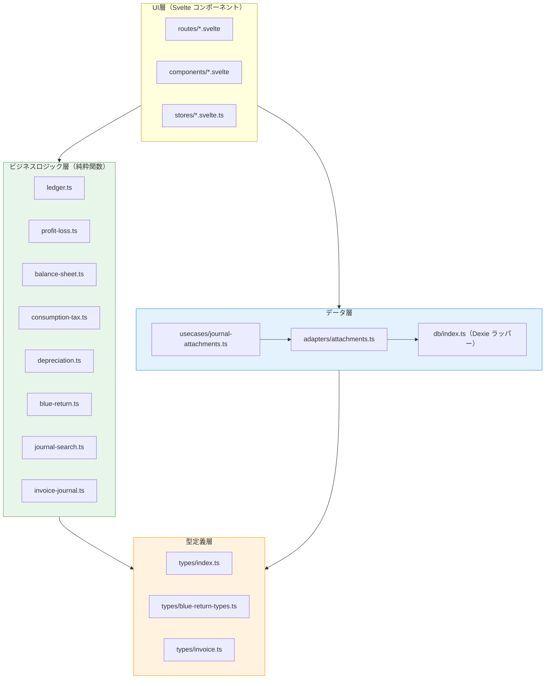
```mermaid
graph TB
    subgraph UI["UI層（Svelte コンポーネント）"]
        Routes["routes/*.svelte"]
        Components["components/*.svelte"]
        Stores["stores/*.svelte.ts"]
    end

    subgraph Business["ビジネスロジック層（純粋関数）"]
        Ledger["ledger.ts"]
        PL["profit-loss.ts"]
        BS["balance-sheet.ts"]
        Tax["consumption-tax.ts"]
        Depreciation["depreciation.ts"]
        BlueReturn["blue-return.ts"]
        Search["journal-search.ts"]
        Invoice["invoice-journal.ts"]
    end

    subgraph Data["データ層"]
        DB["db/index.ts（Dexie ラッパー）"]
        Adapters["adapters/attachments.ts"]
        UseCases["usecases/journal-attachments.ts"]
    end

    subgraph Types["型定義層"]
        CoreTypes["types/index.ts"]
        BlueTypes["types/blue-return-types.ts"]
        InvTypes["types/invoice.ts"]
    end

    UI --> Business
    UI --> Data
    Business --> Types
    Data --> Types
    UseCases --> Adapters
    Adapters --> DB

    style Business fill:#e8f5e9,stroke:#4caf50
    style Data fill:#e3f2fd,stroke:#2196f3
    style Types fill:#fff3e0,stroke:#ff9800
```

### 2.2 MCP化への適性：★★★★★

| 層               | 分離度     | 理由                                                        |
| ---------------- | ---------- | ----------------------------------------------------------- |
| ビジネスロジック | ⭐⭐⭐⭐⭐ | 純粋関数、UI依存なし。そのまま再利用可能                    |
| データ層         | ⭐⭐⭐⭐☆  | Dexie ラッパーで抽象化済み。Adapter パターン導入済み        |
| 型定義           | ⭐⭐⭐⭐⭐ | 完全独立。パッケージ化可能                                  |
| UI層             | ⭐⭐⭐☆☆   | JournalRow.svelte が大きい（1,224行）が、ロジックは委譲済み |

### 2.3 コア関数の再利用性

```
db/index.ts → 80+ の公開API関数
  ├─ Journal CRUD（11関数）
  ├─ Account CRUD（8関数）
  ├─ Vendor CRUD（7関数）
  ├─ Invoice CRUD（10関数）
  ├─ Attachment 操作（9関数）
  ├─ Import/Export（8関数）
  └─ Utility（15+関数）

utils/ → 26ファイルの純粋関数群
  ├─ 帳簿生成（ledger, trial-balance, profit-loss, balance-sheet）
  ├─ 税務計算（consumption-tax, depreciation, blue-return）
  ├─ データ処理（journal-search, journal-copy, business-ratio）
  └─ エクスポート（zip-export, zip-import）
```

---

## 3. 構想1: AIエージェントにe-shiwakeを操作させる

### 3.1 概要

既存のUI付きe-shiwakeを外部AIエージェントから制御する。ユーザーはブラウザでe-shiwakeを表示しつつ、AIエージェントが操作を代行する。

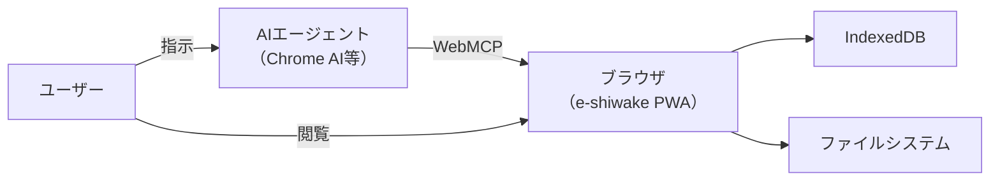
```mermaid
graph LR
    User["ユーザー"]
    Agent["AIエージェント<br/>（Chrome AI等）"]
    Browser["ブラウザ<br/>（e-shiwake PWA）"]
    IDB["IndexedDB"]
    FS["ファイルシステム"]

    User -->|指示| Agent
    Agent -->|WebMCP| Browser
    Browser --> IDB
    Browser --> FS
    User -->|閲覧| Browser
```

### 3.2 選択肢の比較

#### A. WebMCP（W3C標準）✅ PoC実装済み

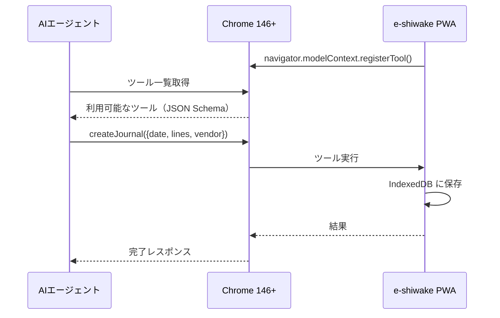
```mermaid
sequenceDiagram
    participant Agent as AIエージェント
    participant Chrome as Chrome 146+
    participant App as e-shiwake PWA

    App->>Chrome: navigator.modelContext.registerTool()
    Agent->>Chrome: ツール一覧取得
    Chrome-->>Agent: 利用可能なツール（JSON Schema）
    Agent->>Chrome: createJournal({date, lines, vendor})
    Chrome->>App: ツール実行
    App->>App: IndexedDB に保存
    App-->>Chrome: 結果
    Chrome-->>Agent: 完了レスポンス
```

**実装状況（2026-02-22 PoC完了）**:

```
src/lib/webmcp/
├── types.ts    # navigator.modelContext の型定義
├── tools.ts    # 12ツールの定義と実装
└── index.ts    # init/destroy モジュール（graceful degradation）
```

**登録済みツール（12個）**:

| カテゴリ       | ツール名                  | 概要             |
| -------------- | ------------------------- | ---------------- |
| 仕訳管理       | search_journals           | 全年度横断検索   |
|                | get_journals_by_year      | 年度指定取得     |
|                | create_journal            | 仕訳作成         |
|                | delete_journal            | 仕訳削除         |
| マスタ参照     | list_accounts             | 勘定科目一覧     |
|                | list_vendors              | 取引先一覧       |
| 帳簿生成       | generate_ledger           | 総勘定元帳       |
|                | generate_trial_balance    | 試算表           |
|                | generate_profit_loss      | 損益計算書       |
|                | generate_balance_sheet    | 貸借対照表       |
| 税務           | calculate_consumption_tax | 消費税集計       |
| ユーティリティ | get_available_years       | 利用可能年度一覧 |

**動作確認結果**:

| 環境                             | 動作                                                   |
| -------------------------------- | ------------------------------------------------------ |
| Chrome Canary 146+（flags有効）  | 12ツール登録、AIエージェントに公開                     |
| 通常の Chrome / Safari / Firefox | 情報メッセージのみ、エラーなし（graceful degradation） |

| 項目           | 評価                                                        |
| -------------- | ----------------------------------------------------------- |
| **メリット**   | ブラウザ内で完結、認証不要、ユーザーセッション継承          |
| **デメリット** | Chrome 146+ のみ（2026年2月現在 Early Preview）、iPad非対応 |
| **実装コスト** | 低（既存のdb/utils関数をそのまま呼び出し）                  |
| **成熟度**     | ⚠️ 極めて初期段階（2026年2月時点で Canary のみ）            |

#### B. e-shiwake Skill（Claude Code / Cowork）

Skillはコードを書くのではなく、既存のUI操作手順をマークダウンで記述する。AIエージェント（Claude Code / Cowork）がこの手順を参照してユーザーの指示を実行する。

```markdown
# e-shiwake 操作スキル（SKILL.md）

## 仕訳入力の手順

1. e-shiwake（https://shuji-bonji.github.io/e-shiwake/）を開く
2. サイドバーで対象年度を選択
3. [➕ 新規仕訳] ボタンをクリック
4. 日付、摘要、勘定科目、金額、取引先を入力
5. 借方合計 = 貸方合計 を確認
6. 確定ボタンをクリック
```

| 項目           | 評価                                              |
| -------------- | ------------------------------------------------- |
| **メリット**   | 実装コスト最小、すぐに使える、llms.txt と補完関係 |
| **デメリット** | ブラウザ操作ツール（Claude in Chrome等）が前提    |
| **実装コスト** | 極低（SKILL.mdを書くだけ）                        |
| **成熟度**     | ✅ Claude Code / Cowork で利用可能                |

### 3.3 Playwright の位置づけ（E2Eテスト専用）

> **決定事項**: Playwright は**フォールバック手段から除外**。開発用E2Eテストとしてのみ使用する。

**除外理由**:

- ユーザーにNode.js + Playwright（Chromiumバイナリ含む数百MB）のインストール負担がかかる
- DOM構造に依存し、UI変更のたびにセレクタの更新が必要
- 実行のたびにブラウザが起動し、体感が重い
- WebMCPが使えない場合、Concept 2（MCP Server で直接DB操作）の方が速くて確実

**E2Eテストとしての活用**:

- WebMCPツール12個の動作をE2Eテストで検証（開発時）
- 仕訳CRUD、帳簿生成、検索機能の統合テスト
- CI/CDパイプラインでのリグレッションテスト

### 3.4 構想1のフォールバック戦略

```
WebMCP（メイン、Chrome 146+）
  ↓ 非対応環境
MCP Server（構想2 = UIレス、Node.js環境）
  ↓ 導入できない場合
Skill（SKILL.md = 手順書 + ブラウザ操作ツール）
```

WebMCPが利用できない環境では、Playwright でUIを叩くのではなく、構想2のMCP Serverで直接データ操作するか、Skillでブラウザ操作ツール（Claude in Chrome等）を活用する。

### 3.5 llms.txt による自己記述

e-shiwakeは `/llms.txt` エンドポイントでアプリ自身の情報をAIエージェントに公開している。

**実装済みエンドポイント**:

| URL                     | 内容                                     |
| ----------------------- | ---------------------------------------- |
| `/llms.txt`             | サービス概要 + WebMCPツール全12個の仕様  |
| `/help/webmcp/llms.txt` | WebMCPツールの詳細な使い方・仕訳例       |
| `/help/*/llms.txt`      | 各機能のヘルプ（仕訳、帳簿、証憑管理等） |

**llms.txt と Skill の補完関係**:

| 観点     | llms.txt                        | Skill（SKILL.md）                            |
| -------- | ------------------------------- | -------------------------------------------- |
| 提供元   | アプリ側（e-shiwake自身が配信） | エージェント側（Claude Code / Coworkに配置） |
| 内容     | アプリの仕様・APIリファレンス   | 操作手順・ワークフロー・会計ルール           |
| 対象     | すべてのAIエージェント          | Claude Code / Cowork 専用                    |
| 取得方法 | HTTP GET                        | ローカルファイル読み込み                     |

---

## 4. 構想2: UIレスでAIエージェント内に完結

### 4.1 概要

e-shiwakeのUI層を取り除き、データ操作のコア部分をMCPサーバーとして直接公開する。AIエージェントがUIの代わりになる。

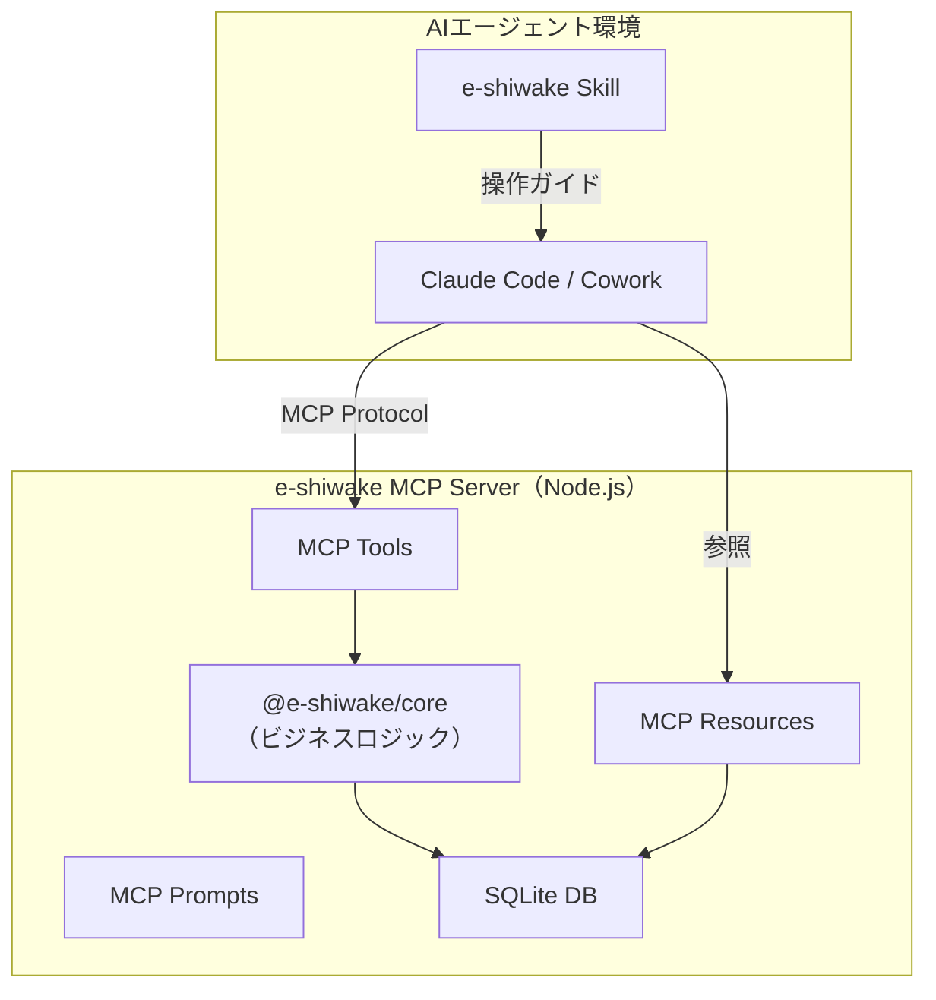
```mermaid
graph TB
    subgraph Agent["AIエージェント環境"]
        Claude["Claude Code / Cowork"]
        Skill["e-shiwake Skill"]
    end

    subgraph MCP["e-shiwake MCP Server（Node.js）"]
        Tools["MCP Tools"]
        Resources["MCP Resources"]
        Prompts["MCP Prompts"]
        Core["@e-shiwake/core<br/>（ビジネスロジック）"]
        SQLite["SQLite DB"]
    end

    Claude -->|MCP Protocol| Tools
    Claude -->|参照| Resources
    Skill -->|操作ガイド| Claude
    Tools --> Core
    Core --> SQLite
    Resources --> SQLite
```

### 4.2 アーキテクチャ

#### パッケージ構成

```
e-shiwake/
├── packages/
│   ├── core/                    # @e-shiwake/core
│   │   ├── types/               # 型定義（現在の src/lib/types/）
│   │   ├── utils/               # ビジネスロジック（現在の src/lib/utils/）
│   │   └── index.ts
│   │
│   ├── db-dexie/                # @e-shiwake/db-dexie
│   │   └── index.ts             # ブラウザ用（現在の src/lib/db/）
│   │
│   ├── db-sqlite/               # @e-shiwake/db-sqlite
│   │   ├── schema.sql
│   │   ├── repository.ts        # DatabasePort 実装
│   │   └── index.ts
│   │
│   └── mcp-server/              # @e-shiwake/mcp-server
│       ├── tools/               # MCP ツール定義
│       │   ├── journal.ts
│       │   ├── account.ts
│       │   ├── report.ts
│       │   └── tax.ts
│       ├── resources/           # MCP リソース定義
│       ├── prompts/             # MCP プロンプト定義
│       └── index.ts             # エントリポイント
│
├── apps/
│   └── web/                     # 現在の SvelteKit PWA
│       └── src/
└── package.json                 # monorepo (pnpm workspace)
```

#### データベースポート（抽象化層）

```typescript
// packages/core/ports/database.ts
export interface DatabasePort {
	// Journal
	getJournalsByYear(year: number): Promise<JournalEntry[]>;
	getAllJournals(): Promise<JournalEntry[]>;
	addJournal(journal: Omit<JournalEntry, 'id'>): Promise<string>;
	updateJournal(id: string, journal: Partial<JournalEntry>): Promise<void>;
	deleteJournal(id: string): Promise<void>;

	// Account
	getAllAccounts(): Promise<Account[]>;
	getAccountsByType(type: AccountType): Promise<Account[]>;

	// Vendor
	getAllVendors(): Promise<Vendor[]>;
	searchVendors(query: string): Promise<Vendor[]>;

	// Invoice
	getInvoicesByYear(year: number): Promise<Invoice[]>;
	addInvoice(invoice: Omit<Invoice, 'id'>): Promise<string>;

	// Settings
	getSetting<K extends keyof SettingsValueMap>(key: K): Promise<SettingsValueMap[K] | undefined>;
}
```

### 4.3 MCP ツール設計

#### Tools（操作系）

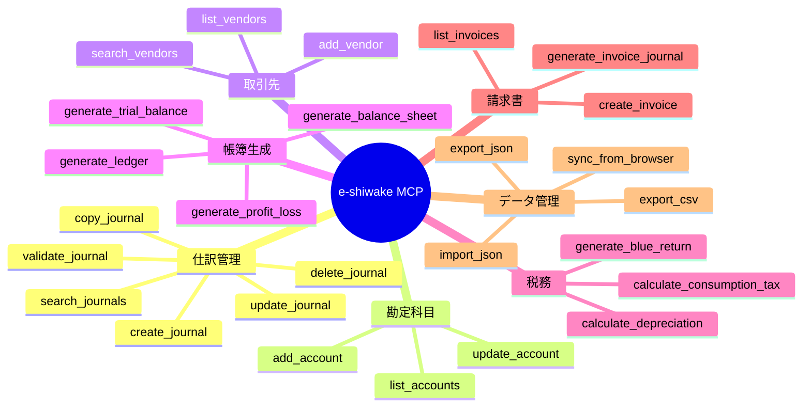
```mermaid
mindmap
  root((e-shiwake MCP))
    仕訳管理
      search_journals
      create_journal
      update_journal
      delete_journal
      copy_journal
      validate_journal
    勘定科目
      list_accounts
      add_account
      update_account
    取引先
      list_vendors
      search_vendors
      add_vendor
    帳簿生成
      generate_ledger
      generate_trial_balance
      generate_profit_loss
      generate_balance_sheet
    税務
      calculate_consumption_tax
      calculate_depreciation
      generate_blue_return
    請求書
      list_invoices
      create_invoice
      generate_invoice_journal
    データ管理
      export_json
      export_csv
      import_json
      sync_from_browser
```

#### Resources（参照系）

| URI パターン                              | 説明               | 例               |
| ----------------------------------------- | ------------------ | ---------------- |
| `eshiwake://accounts`                     | 勘定科目マスタ一覧 | 全勘定科目       |
| `eshiwake://vendors`                      | 取引先一覧         | 全取引先         |
| `eshiwake://journals/{year}`              | 年度別仕訳データ   | 2025年度の仕訳   |
| `eshiwake://reports/trial-balance/{year}` | 試算表             | 2025年度の試算表 |
| `eshiwake://reports/profit-loss/{year}`   | 損益計算書         | 2025年度のPL     |
| `eshiwake://tax/summary/{year}`           | 消費税集計         | 2025年度の消費税 |

#### Prompts（ワークフロー）

| プロンプト名         | 用途         | 引数                        |
| -------------------- | ------------ | --------------------------- |
| `monthly_review`     | 月次レビュー | fiscalYear, month           |
| `year_end_closing`   | 年度末決算   | fiscalYear                  |
| `tax_filing_prep`    | 確定申告準備 | fiscalYear                  |
| `journal_suggestion` | 仕訳提案     | description, amount, vendor |

### 4.4 データ同期戦略

ブラウザPWA（IndexedDB）とMCP Server（SQLite）の間のデータ同期が最大の課題。

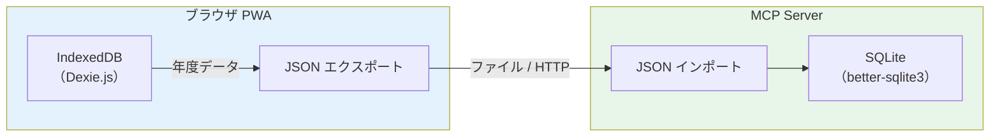
```mermaid
graph LR
    subgraph Browser["ブラウザ PWA"]
        IDB["IndexedDB<br/>（Dexie.js）"]
        Export["JSON エクスポート"]
    end

    subgraph Server["MCP Server"]
        Import["JSON インポート"]
        SQLite["SQLite<br/>（better-sqlite3）"]
    end

    IDB -->|年度データ| Export
    Export -->|ファイル / HTTP| Import
    Import --> SQLite

    style Browser fill:#e3f2fd
    style Server fill:#e8f5e9
```

**同期方式の選択肢**:

| 方式                                    | 難易度    | リアルタイム性 | 推奨フェーズ |
| --------------------------------------- | --------- | -------------- | ------------ |
| **手動 JSON エクスポート → インポート** | ⭐ 簡単   | なし           | Phase 1      |
| **PWAからHTTP POST自動同期**            | ⭐⭐ 中   | 変更時         | Phase 2      |
| **WebSocket双方向同期**                 | ⭐⭐⭐ 高 | リアルタイム   | Phase 3      |
| **SQLiteをブラウザでも使用（sql.js）**  | ⭐⭐⭐ 高 | 同一DB         | 将来         |

**Phase 1 推奨**: e-shiwakeの既存JSONエクスポート機能をそのまま活用。MCP Server側にインポートコマンドを用意。

```bash
# Claude Code / Cowork からの操作イメージ
Claude> e-shiwakeの2025年度データをインポートして

→ MCP Tool: import_json
→ ファイル選択: e-shiwake-export-2025.json
→ SQLiteにデータ投入完了
→ 以降はMCPツールで自由に操作可能
```

### 4.5 技術スタック

| レイヤー       | 技術                                           | 理由                       |
| -------------- | ---------------------------------------------- | -------------------------- |
| MCP SDK        | `@modelcontextprotocol/sdk` v1.10+             | 公式TypeScript SDK         |
| トランスポート | stdio（ローカル）/ Streamable HTTP（リモート） | MCP仕様 2025-03-26 準拠    |
| DB             | `better-sqlite3`                               | 同期API、高速、Node.js最適 |
| バリデーション | `zod`                                          | MCP SDKと親和性が高い      |
| テスト         | `vitest`                                       | 既存プロジェクトと統一     |
| パッケージ管理 | `pnpm workspace`                               | monorepo管理               |

---

## 5. 構想1 vs 構想2 比較

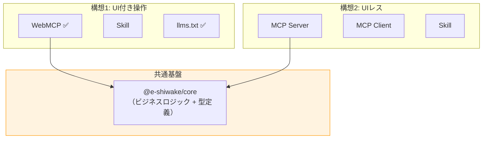
```mermaid
graph TB
    subgraph Plan1["構想1: UI付き操作"]
        P1A["WebMCP ✅"]
        P1B["Skill"]
        P1C["llms.txt ✅"]
    end

    subgraph Plan2["構想2: UIレス"]
        P2A["MCP Server"]
        P2B["MCP Client"]
        P2C["Skill"]
    end

    subgraph Shared["共通基盤"]
        Core["@e-shiwake/core<br/>（ビジネスロジック + 型定義）"]
    end

    P1A --> Core
    P2A --> Core

    style Shared fill:#fff3e0,stroke:#ff9800
```

| 観点                 | 構想1（UI付き操作）              | 構想2（UIレス）                     |
| -------------------- | -------------------------------- | ----------------------------------- |
| **ユーザー体験**     | ブラウザUIを見ながらAIが操作     | AIとの対話のみで完結                |
| **実装コスト**       | 低（WebMCP PoC実装済み）         | 中〜高（MCP Server構築が必要）      |
| **データ整合性**     | ✅ 単一データソース（IndexedDB） | ⚠️ 同期が必要（IndexedDB ↔ SQLite） |
| **オフライン対応**   | ✅ PWAとして完全対応             | ⚠️ MCP Serverが動作している必要     |
| **iPad対応**         | ⚠️ WebMCPは非対応                | ⚠️ ローカルサーバー起動が困難       |
| **帳簿の視覚確認**   | ✅ ブラウザで確認可能            | ❌ テキスト/CSV出力のみ             |
| **スケーラビリティ** | △ ブラウザ依存                   | ✅ サーバー側で拡張自由             |
| **将来性**           | WebMCPの標準化次第               | MCP仕様は安定化の方向               |
| **技術的挑戦度**     | 低（既存技術の組み合わせ）       | 高（新規アーキテクチャ設計）        |

---

## 6. Phase 1 実験の学び（2026-03 追記）

### 6.1 PWA内蔵AIチャットの実験

Phase 0 完了後、PWA内にAIチャット機能を組み込む実験を行った（Anthropic Messages API 直接呼び出し + tool_use）。

**実装した内容**:

- Anthropic Messages API をブラウザから直接呼び出し（`anthropic-dangerous-direct-browser-access`）
- WebMCP の12ツールの `execute` 関数を再利用した tool_use ループ
- Svelte 5 rune ベースのチャット状態管理（localStorage永続化）
- shadcn-svelte Sheet コンポーネントによるサイドパネルUI
- APIキー・モデル選択の設定ダイアログ

**得られた知見**:

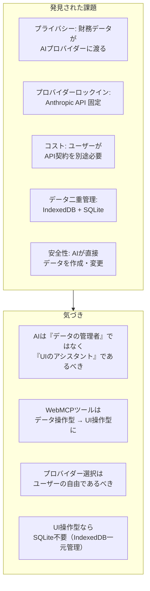
```mermaid
graph TB
    subgraph Problem["発見された課題"]
        P1["プライバシー: 財務データが<br/>AIプロバイダーに渡る"]
        P2["プロバイダーロックイン:<br/>Anthropic API 固定"]
        P3["コスト: ユーザーが<br/>API契約を別途必要"]
        P4["データ二重管理:<br/>IndexedDB + SQLite"]
        P5["安全性: AIが直接<br/>データを作成・変更"]
    end

    subgraph Insight["気づき"]
        I1["AIは『データの管理者』ではなく<br/>『UIのアシスタント』であるべき"]
        I2["WebMCPツールは<br/>データ操作型 → UI操作型に"]
        I3["プロバイダー選択は<br/>ユーザーの自由であるべき"]
        I4["UI操作型なら<br/>SQLite不要（IndexedDB一元管理）"]
    end

    Problem --> Insight
```

### 6.2 データ操作型 vs UI操作型

Phase 1 の実験で最も重要な気づきは、**WebMCPツールの設計思想**に関するものだった。

#### データ操作型（Phase 1 で実装）

```
ユーザー: 「Amazonで3,980円のUSBケーブル買った」
AI → createJournal() → IndexedDB に直接書き込み → 完了
問題: ユーザーが確認する前にデータが確定してしまう
```

#### UI操作型（あるべき姿）

```
ユーザー: 「Amazonで3,980円のUSBケーブル買った」
AI → openJournalEditor() → フォームに値を埋める → ユーザーに表示
ユーザー: 「貸方はクレカだな」→ 確定ボタンを押す
```

**UI操作型の利点**:

| 観点           | データ操作型     | UI操作型               |
| -------------- | ---------------- | ---------------------- |
| 安全性         | AIが直接変更     | ユーザーが確認・確定   |
| 会計判断       | AIに委ねる       | ユーザーが行う         |
| 学習効果       | なし             | AIの提案を見て学べる   |
| エラー回復     | 取り消しが必要   | 確定前に修正可能       |
| バリデーション | API側で実装      | 既存UIロジックを再利用 |
| データ整合性   | 独自に保証が必要 | 既存のUIフローが保証   |

**Human-in-the-Loop**: 会計データは確定申告に直結するため、「AIが勝手に作って終わり」は危険。ユーザーが確認・確定するステップがあることで安全性と信頼性が向上する。

### 6.3 アーキテクチャの再評価

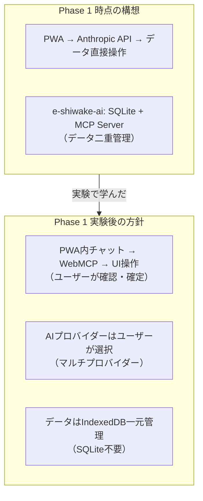
```mermaid
graph TB
    subgraph Before["Phase 1 時点の構想"]
        B1["PWA → Anthropic API → データ直接操作"]
        B2["e-shiwake-ai: SQLite + MCP Server<br/>（データ二重管理）"]
    end

    subgraph After["Phase 1 実験後の方針"]
        A1["PWA内チャット → WebMCP → UI操作<br/>（ユーザーが確認・確定）"]
        A2["AIプロバイダーはユーザーが選択<br/>（マルチプロバイダー）"]
        A3["データはIndexedDB一元管理<br/>（SQLite不要）"]
    end

    Before -->|"実験で学んだ"| After
```

**e-shiwake-ai（MCP Server + SQLite）の位置づけ変更**:

- ~~本命の統合先~~ → **ヘッドレスAPI（CLIツール向け）** として残す
- PWA内のAI体験は WebMCP + UI操作で完結
- データ同期問題が解消（IndexedDB一元管理）

---

## 7. 推奨ロードマップ（v2.0 改訂版）

### Phase 0: WebMCP PoC ✅ 完了

```
目標: WebMCP でのツール登録・動作確認

完了タスク:
- [x] src/lib/webmcp/ ディレクトリ構成
- [x] navigator.modelContext 型定義
- [x] 12ツールの実装（仕訳CRUD、帳簿生成、税務、マスタ参照）
- [x] +layout.svelte でのinit/destroy統合
- [x] graceful degradation（非対応環境でエラーなし）
- [x] /llms.txt にWebMCPツール仕様を追加
- [x] /help/webmcp/ ヘルプページ + llms.txt エンドポイント
- [x] npm run preview での動作確認
```

### Phase 1: PWA内蔵AIチャット実験 ✅ 完了

```
目標: Anthropic API 直接呼び出しでPWA内AIチャットの実現可能性を検証

完了タスク:
- [x] Anthropic Messages API + tool_use ループ実装
- [x] WebMCPツールのexecute関数再利用（tool-executor ブリッジ）
- [x] Svelte 5 rune ベースのチャット状態管理
- [x] shadcn-svelte Sheet によるサイドパネルUI
- [x] APIキー設定・モデル選択ダイアログ

得られた知見:
- [x] プライバシー課題の発見（財務データがAPIプロバイダーに渡る）
- [x] データ操作型 vs UI操作型の設計思想の転換
- [x] マルチプロバイダー対応の必要性認識
- [x] SQLite不要（UI操作型ならIndexedDB一元管理で十分）
```

### Phase 2: UI操作型WebMCPツール（次のステップ）

現在のデータ操作型WebMCPツールを、UI操作型に進化させる。

```
目標: AIが「データ」ではなく「UI」を操作するWebMCPツール体系への移行

タスク:
- [ ] UI操作型ツールの設計・定義
  - openJournalEditor(values)     ← 仕訳編集行を展開し値を埋める
  - openJournalWithCopy(id)       ← 既存仕訳をコピーして編集行を展開
  - confirmDeleteJournal(id)      ← 削除確認ダイアログを表示
  - navigateTo(path)              ← 指定ページに遷移
  - showTrialBalance(year)        ← 試算表ページを表示
  - showProfitLoss(year)          ← 損益計算書ページを表示
  - showBalanceSheet(year)        ← 貸借対照表ページを表示
  - showLedger(accountCode, year) ← 総勘定元帳を表示
  - setSearchQuery(query)         ← 検索クエリを設定して結果表示
  - openInvoiceEditor(values)     ← 請求書編集画面を開いて値を埋める
- [ ] 既存のデータ操作型ツール（参照系）はそのまま残す
  - search_journals   → 結果をチャットに表示（変更なし）
  - list_accounts     → 結果をチャットに表示（変更なし）
  - list_vendors      → 結果をチャットに表示（変更なし）
  - get_available_years → 結果をチャットに表示（変更なし）
- [ ] Svelte storeとの連携
  - UIツールがstoreを更新 → UIがリアクティブに反応
  - 例: openJournalEditor → journalEditorStore に値をセット
        → JournalRow.svelte が自動的に編集モードで展開
- [ ] UIフィードバック
  - AIが操作したことをトースト通知で表示
  - チャットパネルに「仕訳入力フォームを開きました」等のメッセージ
```

**ツール分類の整理**:

| 種別         | ツール                 | AIの動作             | ユーザーの動作   |
| ------------ | ---------------------- | -------------------- | ---------------- |
| **UI操作型** | openJournalEditor      | フォームに値を埋める | 確認して確定     |
| **UI操作型** | confirmDeleteJournal   | 確認ダイアログを表示 | OK or キャンセル |
| **UI操作型** | navigateTo             | ページ遷移           | 内容を閲覧       |
| **参照型**   | search_journals        | 検索して結果を返す   | チャットで確認   |
| **参照型**   | generate_trial_balance | 帳簿を生成して返す   | チャットで確認   |

### Phase 3: マルチプロバイダー対応

ユーザーが自分の契約しているAIプロバイダーを選べるようにする。

```
目標: ユーザーが自身のAPIキーで好きなAIプロバイダーを使えるようにする

タスク:
- [ ] プロバイダー抽象化レイヤー
  - 共通インターフェース: sendMessage(messages, tools) → response
  - tool_use / function_calling の差異を吸収
- [ ] Anthropic (Claude) プロバイダー
  - Messages API + tool_use（Phase 1 実装を再利用）
- [ ] OpenAI (GPT) プロバイダー
  - Chat Completions API + function calling
  - ツール定義の変換（Anthropic形式 → OpenAI形式）
- [ ] Google (Gemini) プロバイダー
  - Gemini API + function calling
- [ ] 設定UIの拡張
  - プロバイダー選択ドロップダウン
  - プロバイダーごとのAPIキー管理
  - モデル選択（プロバイダーに応じて変更）
- [ ] ツール定義の統一形式
  - 内部的に共通形式で定義
  - プロバイダーごとに変換アダプター

アーキテクチャ:
```

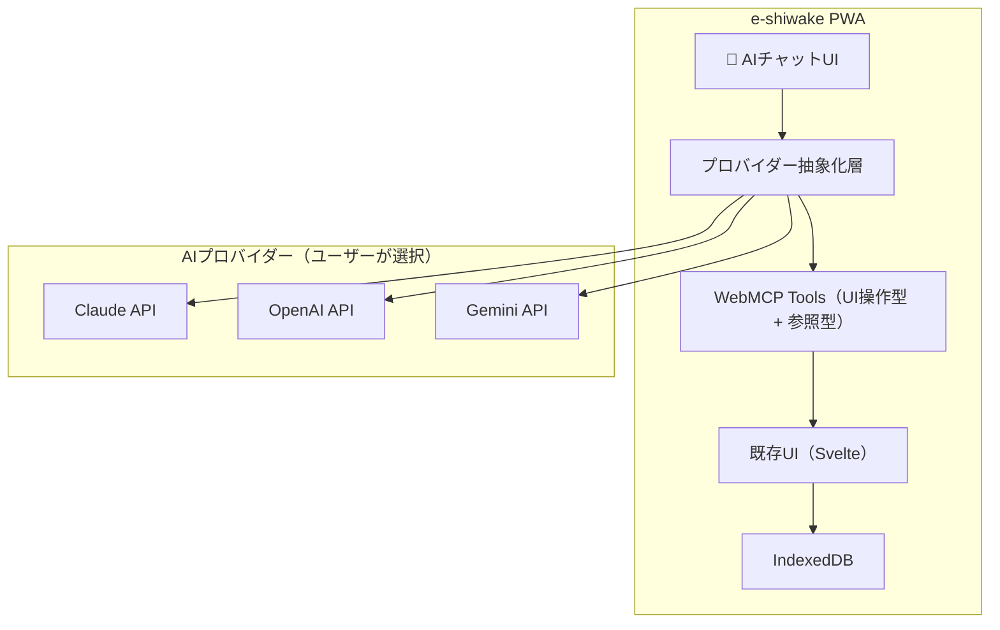
```mermaid
graph TB
    subgraph PWA["e-shiwake PWA"]
        Chat["💬 AIチャットUI"]
        Provider["プロバイダー抽象化層"]
        Tools["WebMCP Tools（UI操作型 + 参照型）"]
        UI["既存UI（Svelte）"]
        IDB["IndexedDB"]
    end

    subgraph Providers["AIプロバイダー（ユーザーが選択）"]
        Claude["Claude API"]
        GPT["OpenAI API"]
        Gemini["Gemini API"]
    end

    Chat --> Provider
    Provider --> Claude
    Provider --> GPT
    Provider --> Gemini
    Provider --> Tools
    Tools --> UI
    UI --> IDB
```

```
プライバシーの考慮:
- 各プロバイダーへの直接API呼び出し（第三者サーバーを経由しない）
- 財務データはツール実行結果としてのみAIに渡る
- APIキーはlocalStorageに保存（ユーザーのブラウザ内完結）
```

### Phase 4: Skill + llms.txt 強化

```
目標: 外部AIエージェント（Claude Code / Cowork / Chrome AI）からの利用を最適化

タスク:
- [ ] e-shiwake Skill（SKILL.md）作成
  - UI操作型WebMCPツールの使い方ガイド
  - 会計ルール（複式簿記、消費税区分）
  - 仕訳入力 → 確認 → 確定のワークフロー
  - 決算ワークフロー
- [ ] llms.txt の更新
  - UI操作型ツールの仕様追記
  - ツールの使い分けガイド（UI操作型 vs 参照型）
- [ ] Playwright E2Eテスト
  - UI操作型ツールの動作検証
  - WebMCP → UI反映のE2Eフロー
```

### Phase 5: WebMCP 安定版統合（2026年後半〜）

```
目標: Chrome安定版でのWebMCP正式対応 + AIチャット体験の完成

タスク:
- [ ] Chrome 安定版リリースに合わせたAPI更新
- [ ] チャットUI + WebMCPの統合完成
  - AIチャットからのUI操作がシームレスに動作
  - 会話コンテキストの保持（セッション管理）
- [ ] ユーザー向けAI機能の案内ページ
- [ ] Cowork プラグイン化の検討
```

### Phase 6: 高度な統合（2027年〜）

```
- [ ] 音声入力対応（Web Speech API → AIチャット）
- [ ] 証憑OCR連携（画像/PDF → AI解析 → 仕訳提案）
- [ ] 多言語対応（i18n）
- [ ] Cowork プラグインとしてパッケージ化
```

---

## 8. 技術的課題と対策（v2.0 改訂版）

### 8.1 UI操作型WebMCPの課題

| 課題                           | 影響                                | 対策                                            |
| ------------------------------ | ----------------------------------- | ----------------------------------------------- |
| Svelte storeとの連携設計       | ツールからUIへの橋渡し              | 専用のUI操作storeを設計                         |
| 複数コンポーネント間の状態同期 | 画面遷移 + フォーム展開の組み合わせ | navigateTo → onMount でフォーム展開のシーケンス |
| 操作のフィードバック           | AIが操作したことをユーザーに伝える  | トースト通知 + チャットメッセージ               |

### 8.2 マルチプロバイダーの課題

| 課題                    | 影響                                           | 対策                                   |
| ----------------------- | ---------------------------------------------- | -------------------------------------- |
| ツール定義形式の差異    | Anthropic / OpenAI / Google で形式が異なる     | 共通形式 → プロバイダー別アダプター    |
| tool_use の振る舞い差異 | ツール呼び出しの精度がプロバイダーにより異なる | プロバイダー別のシステムプロンプト調整 |
| APIキーの安全管理       | ブラウザ内にキーを保存                         | localStorage + 将来的にIndexedDB暗号化 |
| ユーザーの契約状況      | プロバイダーのAPI利用は別途課金                | 設定画面で明確に説明                   |

### 8.3 WebMCP の制約

| 課題               | 影響                 | 対策                                  |
| ------------------ | -------------------- | ------------------------------------- |
| Chrome 146+ のみ   | iPad / Safari 非対応 | AIチャット + 直接API呼び出しで代替    |
| Early Preview 段階 | API変更のリスク      | 抽象化層を設けて変更に対応            |
| Blob の直列化不可  | PDF添付が困難        | Base64 エンコード or ファイルパス参照 |

### 8.4 e-shiwake-ai（MCP Server）の位置づけ

| 課題                        | 影響                       | 対策                                                  |
| --------------------------- | -------------------------- | ----------------------------------------------------- |
| SQLiteとIndexedDBの二重管理 | データ不整合リスク         | PWA内はWebMCPで完結、MCP Serverはヘッドレス用途に限定 |
| 利用シーンの限定            | 非エンジニアには使いにくい | Claude Code / Cowork 向けの補助ツールとして維持       |
| メンテナンスコスト          | 2つのDB層を維持            | core パッケージでロジック共有、DB層のみ分離           |

---

## 9. 判断基準と推奨（v2.0 改訂版）

### 9.1 設計思想

**「AIはUIのアシスタントであって、データの管理者ではない」**

- AIは賢い入力補助をするが、最終判断と確定操作はユーザーが行う
- データの整合性は既存のUIバリデーションが保証する
- AIプロバイダーの選択はユーザーの自由

### 9.2 ゴールイメージ

```
ユーザー: 「Amazonで3,980円のUSBケーブル買った」

AI（PWA内チャット、ユーザー選択のプロバイダー経由）:
  1. list_accounts({type: "expense"})     → 勘定科目確認
  2. openJournalEditor({                  → UI操作型ツール実行
       date: "2026-03-09",
       description: "USBケーブル購入",
       vendor: "Amazon",
       debitLines: [{accountCode: "5003", amount: 3980}],
       creditLines: []  ← 支払方法が不明なので空
     })
  3. チャットに「仕訳入力フォームを開きました。
     貸方（支払方法）を選択して確定してください」と表示

ユーザー: 貸方に「未払金」を選択 → 確定ボタン
  → IndexedDB に保存（既存のUIフローで）
```

### 9.3 棲み分け

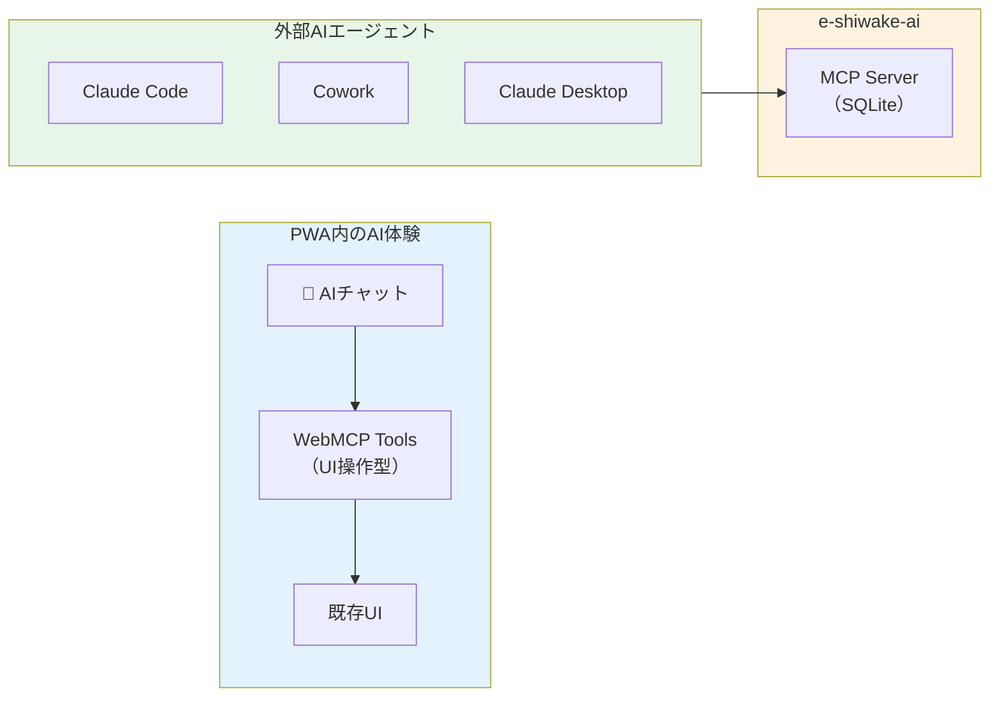
```mermaid
graph LR
    subgraph PWA内["PWA内のAI体験"]
        Chat["💬 AIチャット"]
        WebMCP["WebMCP Tools<br/>（UI操作型）"]
        UIUX["既存UI"]
    end

    subgraph External["外部AIエージェント"]
        CC["Claude Code"]
        CW["Cowork"]
        CD["Claude Desktop"]
    end

    subgraph MCP["e-shiwake-ai"]
        MCPServer["MCP Server<br/>（SQLite）"]
    end

    Chat --> WebMCP --> UIUX
    External --> MCPServer

    style PWA内 fill:#e3f2fd
    style External fill:#e8f5e9
    style MCP fill:#fff3e0
```

| 方式                | 用途                           | ユーザー            | データの場所          |
| ------------------- | ------------------------------ | ------------------- | --------------------- |
| PWA内AIチャット     | カジュアルな仕訳入力、帳簿確認 | 一般ユーザー        | IndexedDB（一元管理） |
| WebMCP（Chrome AI） | ブラウザAIからの直接操作       | Chrome 146+ユーザー | IndexedDB（一元管理） |
| e-shiwake-ai（MCP） | ヘッドレス分析、一括操作       | エンジニア          | SQLite（独立）        |

---

## 10. 参考リソース

### MCP 仕様・SDK

- [Model Context Protocol 仕様](https://modelcontextprotocol.io/specification/2025-03-26)
- [@modelcontextprotocol/sdk (TypeScript)](https://github.com/modelcontextprotocol/typescript-sdk)
- [MCP Server 実装ガイド](https://modelcontextprotocol.io/docs/develop/build-server)

### WebMCP

- [WebMCP 公式サイト](https://webmcp.link/)
- [Chrome DevTools MCP](https://developer.chrome.com/blog/chrome-devtools-mcp)
- [Chrome for Developers - WebMCP EPP](https://developer.chrome.com/blog/webmcp-epp)

### AIプロバイダー API

- [Anthropic Messages API](https://docs.anthropic.com/en/api/messages)
- [OpenAI Chat Completions API](https://platform.openai.com/docs/api-reference/chat)
- [Google Gemini API](https://ai.google.dev/docs)

### Skill 開発

- [Claude をスキルで拡張する](https://code.claude.com/docs/ja/skills)
- [awesome-claude-skills](https://github.com/travisvn/awesome-claude-skills)

### データストア

- [Dexie.js](https://dexie.org/)
- [better-sqlite3](https://github.com/WiseLibs/better-sqlite3)（e-shiwake-ai用）
