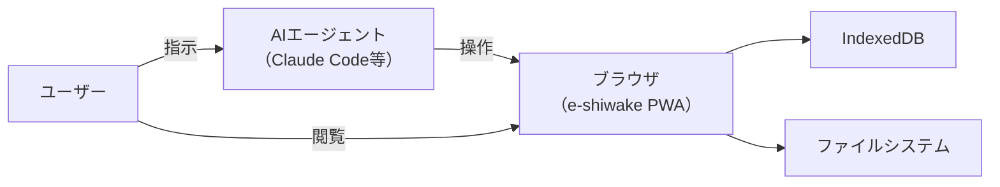
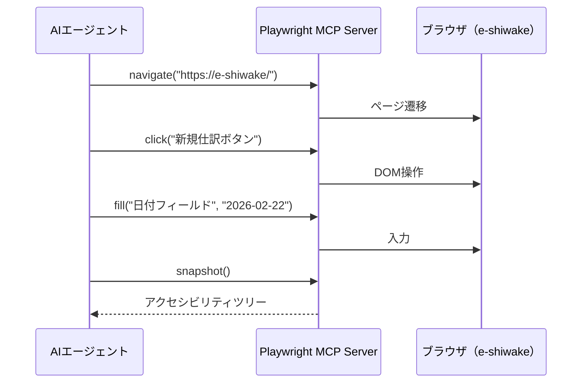
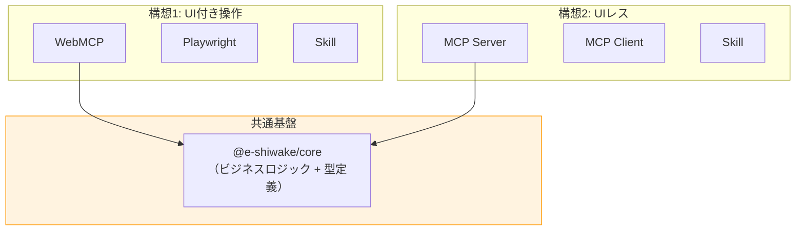

# e-shiwake AI連携 アーキテクチャ設計書

> **ステータス**: Draft v1.0
> **作成日**: 2026-02-22
> **関連**: [GitHub Discussion #19](https://github.com/shuji-bonji/e-shiwake/discussions/19)

---

## 1. 背景と目的

e-shiwake はフリーランス・個人事業主向けの仕訳入力 + 証憑管理 PWA である。現在は SvelteKit + IndexedDB でローカル完結しているが、AIエージェントとの連携により以下の価値を提供したい：

- 仕訳入力の自動化・補助（「この領収書を仕訳して」）
- 帳簿の分析・レポート生成（「今月の経費を分析して」）
- 決算・申告のワークフロー支援（「年度末決算を進めて」）

本ドキュメントでは、2つの構想の技術的実現可能性と設計を整理する。

---

## 2. 現在のアーキテクチャ評価

### 2.1 レイヤー分離状況


### 2.2 MCP化への適性：★★★★★

| 層               | 分離度     | 理由                                                        |
| ---------------- | ---------- | ----------------------------------------------------------- |
| ビジネスロジック | ⭐⭐⭐⭐⭐ | 純粋関数、UI依存なし。そのまま再利用可能                    |
| データ層         | ⭐⭐⭐⭐☆  | Dexie ラッパーで抽象化済み。Adapter パターン導入済み        |
| 型定義           | ⭐⭐⭐⭐⭐ | 完全独立。パッケージ化可能                                  |
| UI層             | ⭐⭐⭐☆☆   | JournalRow.svelte が大きい（1,224行）が、ロジックは委譲済み |

### 2.3 コア関数の再利用性

```
db/index.ts → 80+ の公開API関数
  ├─ Journal CRUD（11関数）
  ├─ Account CRUD（8関数）
  ├─ Vendor CRUD（7関数）
  ├─ Invoice CRUD（10関数）
  ├─ Attachment 操作（9関数）
  ├─ Import/Export（8関数）
  └─ Utility（15+関数）

utils/ → 26ファイルの純粋関数群
  ├─ 帳簿生成（ledger, trial-balance, profit-loss, balance-sheet）
  ├─ 税務計算（consumption-tax, depreciation, blue-return）
  ├─ データ処理（journal-search, journal-copy, business-ratio）
  └─ エクスポート（zip-export, zip-import）
```

---

## 3. 構想1: AIエージェントにe-shiwakeを操作させる

### 3.1 概要

既存のUI付きe-shiwakeを外部AIエージェントから制御する。ユーザーはブラウザでe-shiwakeを表示しつつ、AIエージェントが操作を代行する。



### 3.2 選択肢の比較

#### A. WebMCP（W3C標準）


**実装イメージ**:

```typescript
// e-shiwake 側に追加（src/lib/webmcp/register-tools.ts）
export function registerWebMCPTools() {
	navigator.modelContext.registerTool({
		name: 'search_journals',
		description: '仕訳を全年度横断で検索',
		inputSchema: {
			type: 'object',
			properties: {
				keyword: { type: 'string', description: '検索キーワード' },
				fiscalYear: { type: 'number', description: '会計年度（省略時は全年度）' }
			},
			required: ['keyword']
		},
		async execute(args) {
			const journals = await getAllJournals();
			const results = searchJournals(args.keyword, journals);
			return {
				content: [{ type: 'text', text: JSON.stringify(results) }]
			};
		}
	});
}
```

| 項目           | 評価                                                        |
| -------------- | ----------------------------------------------------------- |
| **メリット**   | ブラウザ内で完結、認証不要、ユーザーセッション継承          |
| **デメリット** | Chrome 146+ のみ（2026年2月現在 Early Preview）、iPad非対応 |
| **実装コスト** | 低（既存のdb/utils関数をそのまま呼び出し）                  |
| **成熟度**     | ⚠️ 極めて初期段階（2026年2月時点で Canary のみ）            |

#### B. Playwright MCP



| 項目           | 評価                                                      |
| -------------- | --------------------------------------------------------- |
| **メリット**   | 既存UIをそのまま利用、幅広いブラウザ対応                  |
| **デメリット** | DOM構造に依存（UI変更で壊れる）、トークンコスト高         |
| **実装コスト** | 低（追加コード不要、Playwright MCP Serverを設定するだけ） |
| **成熟度**     | ✅ 安定（Playwright自体は成熟技術）                       |

#### C. e-shiwake Skill（Claude Code / Cowork）

Skillはコードを書くのではなく、既存のUI操作手順をマークダウンで記述する。

```markdown
# e-shiwake 操作スキル（SKILL.md）

## 仕訳入力の手順

1. e-shiwake（https://shuji-bonji.github.io/e-shiwake/）を開く
2. サイドバーで対象年度を選択
3. [➕ 新規仕訳] ボタンをクリック
4. 日付、摘要、勘定科目、金額、取引先を入力
5. 借方合計 = 貸方合計 を確認
6. 確定ボタンをクリック
```

| 項目           | 評価                                   |
| -------------- | -------------------------------------- |
| **メリット**   | 実装コスト最小、すぐに使える           |
| **デメリット** | Playwright等のブラウザ操作ツールが前提 |
| **実装コスト** | 極低（SKILL.mdを書くだけ）             |
| **成熟度**     | ✅ Claude Code/Coworkで利用可能        |

### 3.3 構想1の推奨アプローチ

```
Phase 1（即座）: Skill + Playwright MCP
  → SKILL.md で操作手順を定義
  → Playwright MCP Server で実際のブラウザ操作

Phase 2（2026年後半）: WebMCP Early Adoption
  → Chrome 146+ 安定版リリース後に navigator.modelContext 実装
  → 読み取り系ツールから段階的に導入

Phase 3（2027年〜）: WebMCP Full Integration
  → 書き込み系ツール実装
  → Playwright をフォールバックとして維持
```

---

## 4. 構想2: UIレスでAIエージェント内に完結

### 4.1 概要

e-shiwakeのUI層を取り除き、データ操作のコア部分をMCPサーバーとして直接公開する。AIエージェントがUIの代わりになる。


### 4.2 アーキテクチャ

#### パッケージ構成

```
e-shiwake/
├── packages/
│   ├── core/                    # @e-shiwake/core
│   │   ├── types/               # 型定義（現在の src/lib/types/）
│   │   ├── utils/               # ビジネスロジック（現在の src/lib/utils/）
│   │   └── index.ts
│   │
│   ├── db-dexie/                # @e-shiwake/db-dexie
│   │   └── index.ts             # ブラウザ用（現在の src/lib/db/）
│   │
│   ├── db-sqlite/               # @e-shiwake/db-sqlite
│   │   ├── schema.sql
│   │   ├── repository.ts        # DatabasePort 実装
│   │   └── index.ts
│   │
│   └── mcp-server/              # @e-shiwake/mcp-server
│       ├── tools/               # MCP ツール定義
│       │   ├── journal.ts
│       │   ├── account.ts
│       │   ├── report.ts
│       │   └── tax.ts
│       ├── resources/           # MCP リソース定義
│       ├── prompts/             # MCP プロンプト定義
│       └── index.ts             # エントリポイント
│
├── apps/
│   └── web/                     # 現在の SvelteKit PWA
│       └── src/
└── package.json                 # monorepo (pnpm workspace)
```

#### データベースポート（抽象化層）

```typescript
// packages/core/ports/database.ts
export interface DatabasePort {
	// Journal
	getJournalsByYear(year: number): Promise<JournalEntry[]>;
	getAllJournals(): Promise<JournalEntry[]>;
	addJournal(journal: Omit<JournalEntry, 'id'>): Promise<string>;
	updateJournal(id: string, journal: Partial<JournalEntry>): Promise<void>;
	deleteJournal(id: string): Promise<void>;

	// Account
	getAllAccounts(): Promise<Account[]>;
	getAccountsByType(type: AccountType): Promise<Account[]>;

	// Vendor
	getAllVendors(): Promise<Vendor[]>;
	searchVendors(query: string): Promise<Vendor[]>;

	// Invoice
	getInvoicesByYear(year: number): Promise<Invoice[]>;
	addInvoice(invoice: Omit<Invoice, 'id'>): Promise<string>;

	// Settings
	getSetting<K extends keyof SettingsValueMap>(key: K): Promise<SettingsValueMap[K] | undefined>;
}
```

### 4.3 MCP ツール設計

#### Tools（操作系）


#### Resources（参照系）

| URI パターン                              | 説明               | 例               |
| ----------------------------------------- | ------------------ | ---------------- |
| `eshiwake://accounts`                     | 勘定科目マスタ一覧 | 全勘定科目       |
| `eshiwake://vendors`                      | 取引先一覧         | 全取引先         |
| `eshiwake://journals/{year}`              | 年度別仕訳データ   | 2025年度の仕訳   |
| `eshiwake://reports/trial-balance/{year}` | 試算表             | 2025年度の試算表 |
| `eshiwake://reports/profit-loss/{year}`   | 損益計算書         | 2025年度のPL     |
| `eshiwake://tax/summary/{year}`           | 消費税集計         | 2025年度の消費税 |

#### Prompts（ワークフロー）

| プロンプト名         | 用途         | 引数                        |
| -------------------- | ------------ | --------------------------- |
| `monthly_review`     | 月次レビュー | fiscalYear, month           |
| `year_end_closing`   | 年度末決算   | fiscalYear                  |
| `tax_filing_prep`    | 確定申告準備 | fiscalYear                  |
| `journal_suggestion` | 仕訳提案     | description, amount, vendor |

### 4.4 データ同期戦略

ブラウザPWA（IndexedDB）とMCP Server（SQLite）の間のデータ同期が最大の課題。


**同期方式の選択肢**:

| 方式                                    | 難易度    | リアルタイム性 | 推奨フェーズ |
| --------------------------------------- | --------- | -------------- | ------------ |
| **手動 JSON エクスポート → インポート** | ⭐ 簡単   | なし           | Phase 1      |
| **PWAからHTTP POST自動同期**            | ⭐⭐ 中   | 変更時         | Phase 2      |
| **WebSocket双方向同期**                 | ⭐⭐⭐ 高 | リアルタイム   | Phase 3      |
| **SQLiteをブラウザでも使用（sql.js）**  | ⭐⭐⭐ 高 | 同一DB         | 将来         |

**Phase 1 推奨**: e-shiwakeの既存JSONエクスポート機能をそのまま活用。MCP Server側にインポートコマンドを用意。

```bash
# Claude Code / Cowork からの操作イメージ
Claude> e-shiwakeの2025年度データをインポートして

→ MCP Tool: import_json
→ ファイル選択: e-shiwake-export-2025.json
→ SQLiteにデータ投入完了
→ 以降はMCPツールで自由に操作可能
```

### 4.5 技術スタック

| レイヤー       | 技術                                           | 理由                       |
| -------------- | ---------------------------------------------- | -------------------------- |
| MCP SDK        | `@modelcontextprotocol/sdk` v1.10+             | 公式TypeScript SDK         |
| トランスポート | stdio（ローカル）/ Streamable HTTP（リモート） | MCP仕様 2025-03-26 準拠    |
| DB             | `better-sqlite3`                               | 同期API、高速、Node.js最適 |
| バリデーション | `zod`                                          | MCP SDKと親和性が高い      |
| テスト         | `vitest`                                       | 既存プロジェクトと統一     |
| パッケージ管理 | `pnpm workspace`                               | monorepo管理               |

---

## 5. 構想1 vs 構想2 比較



| 観点                 | 構想1（UI付き操作）              | 構想2（UIレス）                     |
| -------------------- | -------------------------------- | ----------------------------------- |
| **ユーザー体験**     | ブラウザUIを見ながらAIが操作     | AIとの対話のみで完結                |
| **実装コスト**       | 低〜中（Playwright即使用可）     | 中〜高（MCP Server構築が必要）      |
| **データ整合性**     | ✅ 単一データソース（IndexedDB） | ⚠️ 同期が必要（IndexedDB ↔ SQLite） |
| **オフライン対応**   | ✅ PWAとして完全対応             | ⚠️ MCP Serverが動作している必要     |
| **iPad対応**         | ⚠️ WebMCPは非対応                | ⚠️ ローカルサーバー起動が困難       |
| **帳簿の視覚確認**   | ✅ ブラウザで確認可能            | ❌ テキスト/CSV出力のみ             |
| **スケーラビリティ** | △ ブラウザ依存                   | ✅ サーバー側で拡張自由             |
| **将来性**           | WebMCPの標準化次第               | MCP仕様は安定化の方向               |
| **技術的挑戦度**     | 低（既存技術の組み合わせ）       | 高（新規アーキテクチャ設計）        |

---

## 6. 推奨ロードマップ

### Phase 0: 共通基盤（1-2週間）

コアロジックのパッケージ化。構想1・2両方の土台。

```
目標: @e-shiwake/core パッケージの切り出し

タスク:
- [ ] pnpm workspace セットアップ
- [ ] src/lib/types/ → packages/core/types/
- [ ] src/lib/utils/ → packages/core/utils/
- [ ] DatabasePort インターフェース定義
- [ ] 既存テストの移行・動作確認
```

### Phase 1: 構想1 クイックスタート（1週間）

```
目標: Playwright + Skill で最小限のAI連携を実現

タスク:
- [ ] e-shiwake Skill（SKILL.md）作成
  - 仕訳入力手順
  - 帳簿確認手順
  - エクスポート手順
- [ ] Playwright MCP Server 設定ガイド作成
- [ ] 動作検証（Claude Code から e-shiwake を操作）
```

### Phase 2: 構想2 MCP Server MVP（2-4週間）

```
目標: 基本的な仕訳CRUD + 帳簿生成をMCPツールとして提供

タスク:
- [ ] packages/db-sqlite/ 実装
  - SQLite スキーマ設計
  - DatabasePort 実装
  - Dexie JSON → SQLite インポーター
- [ ] packages/mcp-server/ 実装
  - stdio トランスポート
  - 仕訳 CRUD ツール（5ツール）
  - 帳簿生成ツール（4ツール）
  - 勘定科目・取引先 リソース
- [ ] Claude Desktop / Claude Code への登録・動作検証
```

### Phase 3: Skill統合 + プロンプト（1-2週間）

```
目標: MCP Serverと連携するSkillの作成

タスク:
- [ ] e-shiwake MCP Skill（SKILL.md）作成
  - MCP ツールの使い方ガイド
  - 会計ルール（複式簿記、消費税区分）
  - 決算ワークフロー
- [ ] MCP プロンプト定義
  - monthly_review
  - year_end_closing
  - journal_suggestion
- [ ] Cowork プラグイン化の検討
```

### Phase 4: WebMCP 統合（2026年後半〜）

```
目標: Chrome 安定版でのWebMCP対応

タスク:
- [ ] navigator.modelContext ツール登録
- [ ] 読み取り系ツール（検索、帳簿表示）
- [ ] 書き込み系ツール（仕訳作成・編集）
- [ ] Playwright → WebMCP の段階的移行
```

### Phase 5: 高度な統合（2027年〜）

```
- [ ] ブラウザ ↔ MCP Server リアルタイム同期
- [ ] Cowork プラグインとしてパッケージ化
- [ ] 多言語対応（i18n）
- [ ] マルチデバイス同期
```

---

## 7. 技術的課題と対策

### 7.1 データ同期（構想2の最大課題）

| 課題                          | 影響                     | 対策                                   |
| ----------------------------- | ------------------------ | -------------------------------------- |
| IndexedDB ↔ SQLite の二重管理 | データ不整合のリスク     | Phase 1 は手動同期、段階的に自動化     |
| 証憑PDF の扱い                | Blob はJSON化できない    | ZIP エクスポートを活用                 |
| 競合解決                      | 同時編集時のコンフリクト | タイムスタンプベースの Last-Write-Wins |

### 7.2 WebMCP の制約（構想1）

| 課題               | 影響                 | 対策                                  |
| ------------------ | -------------------- | ------------------------------------- |
| Chrome 146+ のみ   | iPad / Safari 非対応 | Playwright をフォールバック           |
| Early Preview 段階 | API変更のリスク      | 抽象化層を設けて変更に対応            |
| Blob の直列化不可  | PDF添付が困難        | Base64 エンコード or ファイルパス参照 |

### 7.3 MCP Server の運用（構想2）

| 課題                       | 影響                       | 対策                              |
| -------------------------- | -------------------------- | --------------------------------- |
| Node.js サーバー起動が必要 | 非エンジニアには敷居が高い | npx 一発起動、Cowork プラグイン化 |
| SQLiteファイル管理         | バックアップ・移行         | e-shiwakeのJSON形式と互換維持     |
| MCP仕様の進化              | 破壊的変更のリスク         | SDK のバージョン固定 + 定期更新   |

---

## 8. 判断基準と推奨

### 8.1 どちらを先に進めるべきか

**推奨: 構想1（Skill + Playwright）→ 構想2（MCP Server）の順**

理由：

1. **構想1は即座に始められる** — SKILL.md を書くだけで最低限の連携が可能
2. **構想2は構想1の学びを活かせる** — AIエージェントが実際に何を操作したいかの知見が得られる
3. **共通基盤（@e-shiwake/core）は両方に必要** — Phase 0 で切り出しておけば無駄がない
4. **構想2はe-shiwakeの価値を最大化する** — 最終的にはMCP Serverが本命

### 8.2 ゴールイメージ

```
ユーザー: 「1月の経費をまとめて」

Claude（e-shiwake Skill + MCP Server 経由）:
  1. search_journals({keyword: "1月", fiscalYear: 2026})
  2. 勘定科目別に集計
  3. generate_profit_loss({fiscalYear: 2026, month: 1})
  4. 結果をMarkdownテーブルで表示

  → 「2026年1月の経費は合計 ¥187,340 です。
     内訳: 通信費 ¥15,000、旅費交通費 ¥32,400、...」
```

---

## 9. 参考リソース

### MCP 仕様・SDK

- [Model Context Protocol 仕様](https://modelcontextprotocol.io/specification/2025-03-26)
- [@modelcontextprotocol/sdk (TypeScript)](https://github.com/modelcontextprotocol/typescript-sdk)
- [MCP Server 実装ガイド](https://modelcontextprotocol.io/docs/develop/build-server)

### WebMCP

- [WebMCP 公式サイト](https://webmcp.link/)
- [Chrome DevTools MCP](https://developer.chrome.com/blog/chrome-devtools-mcp)
- [Chrome for Developers - WebMCP EPP](https://developer.chrome.com/blog/webmcp-epp)

### Skill 開発

- [Claude をスキルで拡張する](https://code.claude.com/docs/ja/skills)
- [awesome-claude-skills](https://github.com/travisvn/awesome-claude-skills)

### データストア

- [better-sqlite3](https://github.com/WiseLibs/better-sqlite3)
- [Dexie.js](https://dexie.org/)
