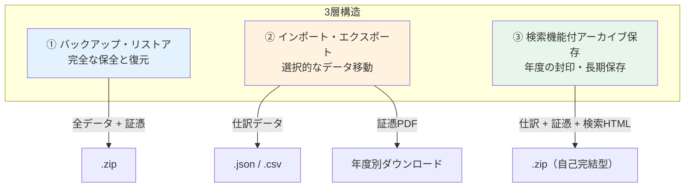
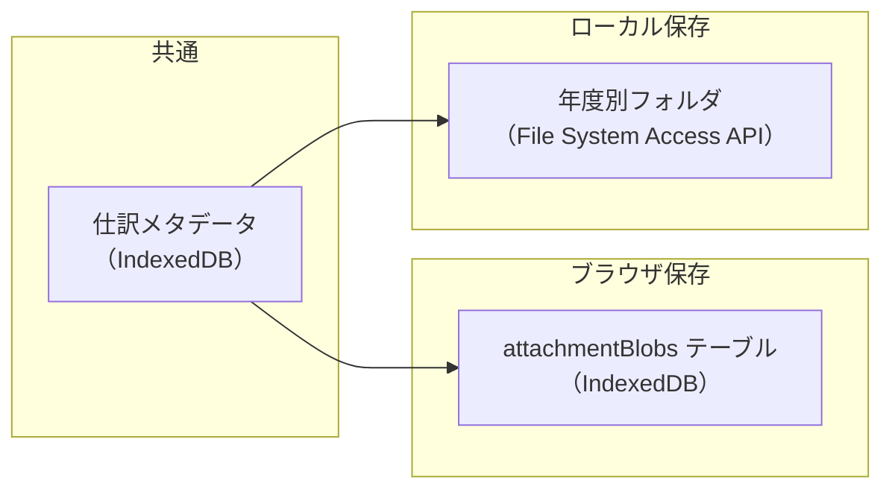
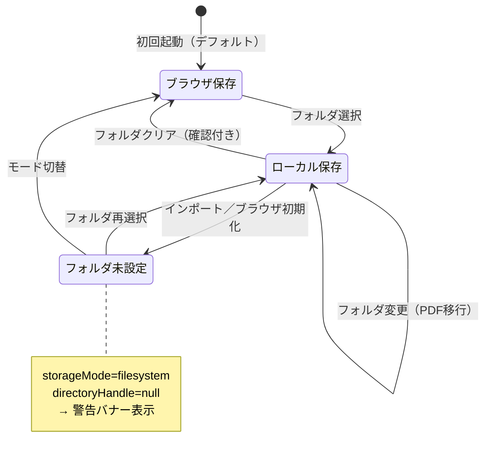

# データ管理の3層構造 — 設計ドキュメント

## 概要

e-shiwake のデータ管理を、目的別に3つの層に整理する。
現状は「エクスポート」という1つの概念でバックアップ・データ移動・年度保存を兼ねているが、
それぞれ要件が異なるため明確に分離する。



---

## ① バックアップ・リストア

### 目的

データの完全な保全と復元。「元に戻す」が目的。

### ユースケース

- 端末移行（PC買い替え、ブラウザプロファイル変更）
- 事故対策（ブラウザのデータ消去、IndexedDB破損）
- テスト環境への復元

### 対象データ

| データ                     | 含む |
| -------------------------- | ---- |
| 仕訳                       | ✅   |
| 勘定科目（ユーザー追加分） | ✅   |
| 取引先                     | ✅   |
| 固定資産                   | ✅   |
| 請求書                     | ✅   |
| 事業者情報                 | ✅   |
| 全設定（storageMode等）    | ✅   |
| 証憑PDF（Blob実体）        | ✅   |

### フォーマット

- `.zip`（data.json + evidences/）

### リストア時の注意点

- `storageMode: 'filesystem'` が復元された場合、フォルダハンドルは引き継がれない
- リストア後に「以前のフォルダ設定が引き継がれていません」警告を表示
- ユーザーがフォルダを再選択するか、ブラウザ保存に切り替えて対応

### 現状（v0.3.x）

- ZIPエクスポート/インポートで基本的に対応済み
- ただし storageMode の整合性チェックは v0.3.2 で追加

---

## ② インポート・エクスポート

### 目的

選択的なデータ移動。他ソフト連携、部分的な取り込み。「使う」が目的。

### ユースケース

- 仕訳データを Excel で確認（CSV）
- 他の会計ソフトへの連携（CSV）
- 仕訳データだけの移行（JSON）
- 証憑PDFの個別ダウンロード（年度別）

### フォーマット

| 形式    | 内容                                    | 方向             |
| ------- | --------------------------------------- | ---------------- |
| `.csv`  | 仕訳のフラット出力                      | エクスポートのみ |
| `.json` | 仕訳 + 科目 + 取引先 + 設定（証憑除く） | 双方向           |
| 個別PDF | 証憑PDFを年度単位でダウンロード         | エクスポートのみ |

### 現状（v0.3.x）

- CSV / JSON エクスポートは対応済み
- JSONインポートは対応済み
- 証憑の個別ダウンロードは CapacityCard で対応済み
- **証憑だけのインポートは未対応**（後述の課題）

---

## ③ 検索機能付アーカイブ保存

### 目的

確定申告後に年度を「封印」する。電帳法の7年保存要件に対応。
アプリにインポートせず、ZIPを展開するだけで過去データを検索・閲覧可能。

### ユースケース

- 確定申告完了後の年度締め
- 税務調査時の証憑提示
- 過去データの参照（アプリにデータを入れ直さずに）

### フォーマット

- `.zip`（仕訳データ + 証憑PDF + `index.html`）

### index.html の機能（Issue #38 構想）

- 仕訳一覧の検索・フィルタ（日付、金額、取引先、摘要）
- 証憑PDFへのリンク（ZIP内の相対パス）
- 完全オフライン動作（外部依存なし）
- 編集不可（読み取り専用）

### 現状

- 未実装（Issue #38）

---

## 証憑の保存先とユースケース

### 2つのストレージモード



どちらのモードでも **仕訳メタデータは IndexedDB** に統一。
違いは証憑PDFの実体の保存先のみ。

### Blob分離（v0.3.2 / Issue #37 Phase 1）の効果

| 改善点         | 説明                                                        |
| -------------- | ----------------------------------------------------------- |
| 容量管理       | エクスポート済みBlobだけ削除可能（メタデータは残る）        |
| パフォーマンス | 仕訳の読み込みにBlobが含まれない                            |
| モード切替     | 仕訳自体は動かず、Blobだけ移行                              |
| アーカイブ対応 | `archived: true` で「Blob削除済みだがメタデータ保持」を表現 |

### ストレージモードのユースケース

| シナリオ                    | モード     | 備考                                 |
| --------------------------- | ---------- | ------------------------------------ |
| Chrome デスクトップ（推奨） | filesystem | フォルダ指定でバックアップ容易       |
| iPad / Safari               | indexeddb  | File System Access API 非対応        |
| 端末移行（同じフォルダ）    | filesystem | フォルダを再選択すれば証憑リンク復活 |
| 端末移行（フォルダなし）    | indexeddb  | ZIPリストアで証憑込み復元            |
| 外付けHDD / NAS             | filesystem | フォルダ変更 → PDF移行ダイアログ     |

### フォルダ設定の状態遷移



---

## 課題と今後の対応

### 対応済み（v0.3.2）

- [x] Blob分離（attachmentBlobs テーブル）— Issue #37 Phase 1
- [x] フォルダ未設定時の警告バナー
- [x] フォルダクリア時の確認ダイアログ（証憑リンク切れ警告）
- [x] 開発用ツールのUI削除

### 未対応（今後の Issue）

| 課題                                        | 関連 Issue  | 優先度 |
| ------------------------------------------- | ----------- | ------ |
| 証憑フォルダの検証・修復（filePath突合）    | #37 Phase 2 | 高     |
| 証憑だけのインポート（ZIPから証憑のみ復元） | #37 Phase 3 | 中     |
| 検索機能付アーカイブZIP生成                 | #38         | 中     |
| UI再構成（3層をカードで分離）               | 新規        | 低     |
| Safari容量警告の改善                        | #37         | 低     |

### UI構成の将来像

```
設定・データ管理
├── 事業者情報
├── 証憑保存先設定
├── バックアップ・リストア          ← 全データ + 証憑の完全保存/復元
│   ├── バックアップ作成 (.zip)
│   └── リストア (.zip)
├── インポート・エクスポート        ← 選択的データ移動
│   ├── CSV出力
│   ├── JSONエクスポート / インポート
│   └── 証憑ダウンロード（年度別）
└── 検索機能付アーカイブ保存        ← 確定申告後の封印
    └── 年度アーカイブZIP生成（検索HTML付き）
```

---

## 関連ドキュメント

- [証憑ストレージ改善設計](./evidence-storage-improvement.md) — Issue #37 の詳細フロー
- [検索HTML設計](./evidence-search-html.md) — Issue #38 の構想
