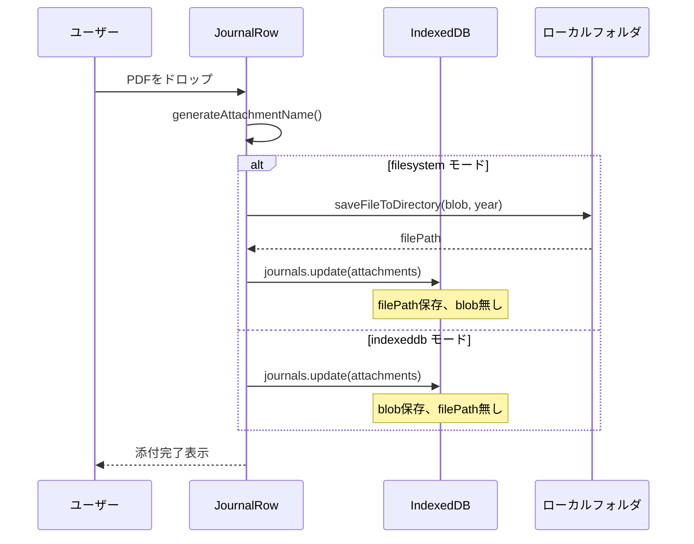
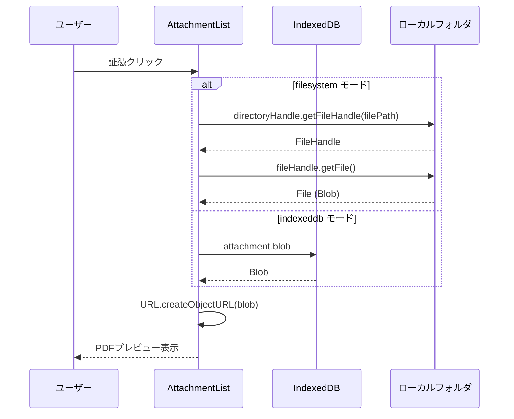
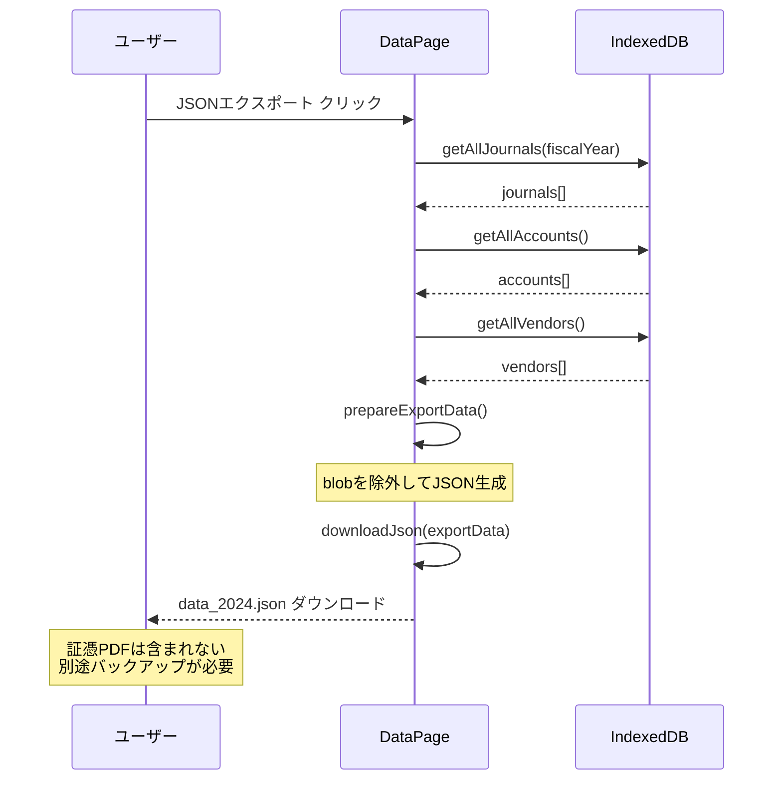
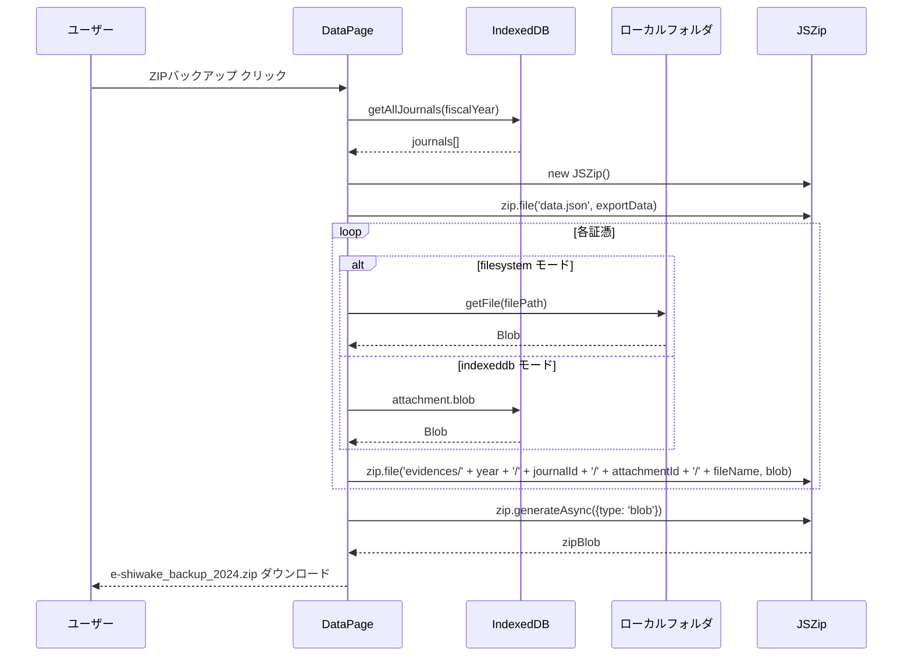
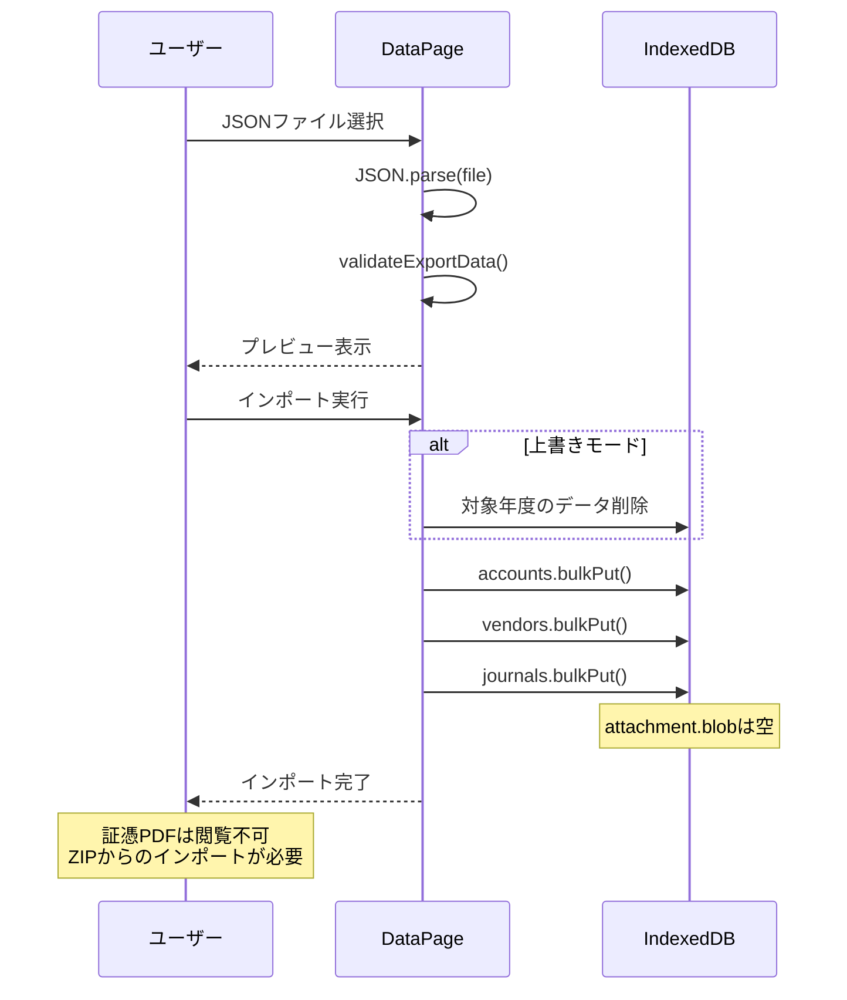
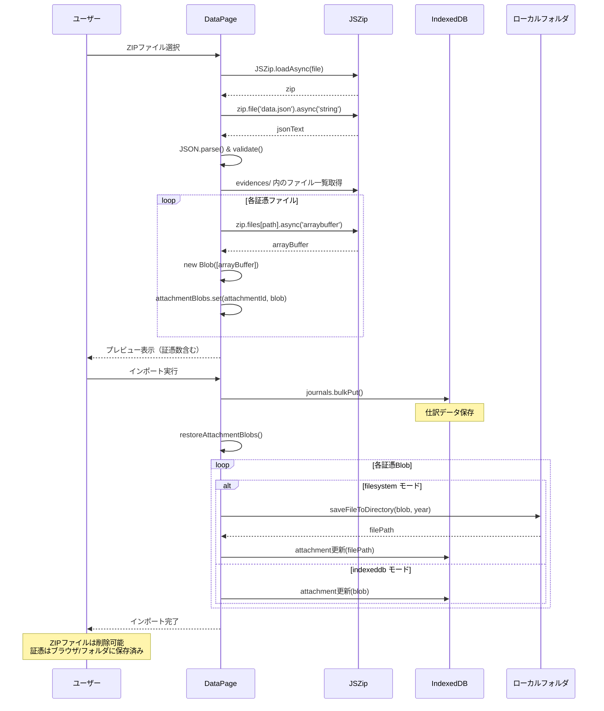
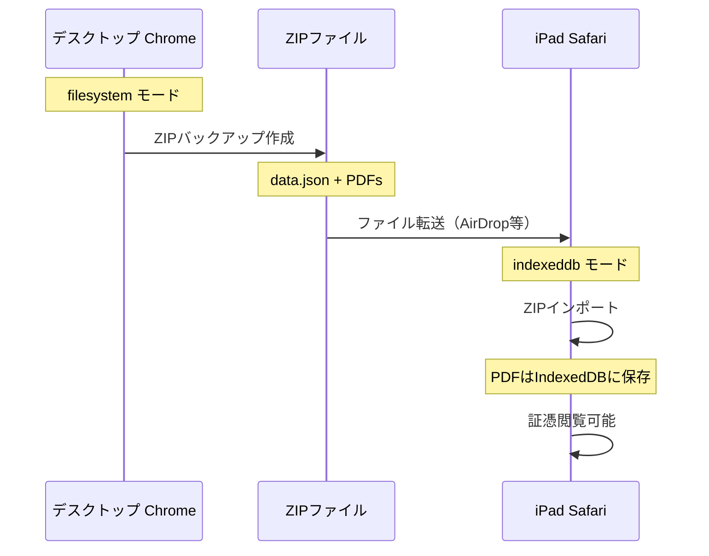
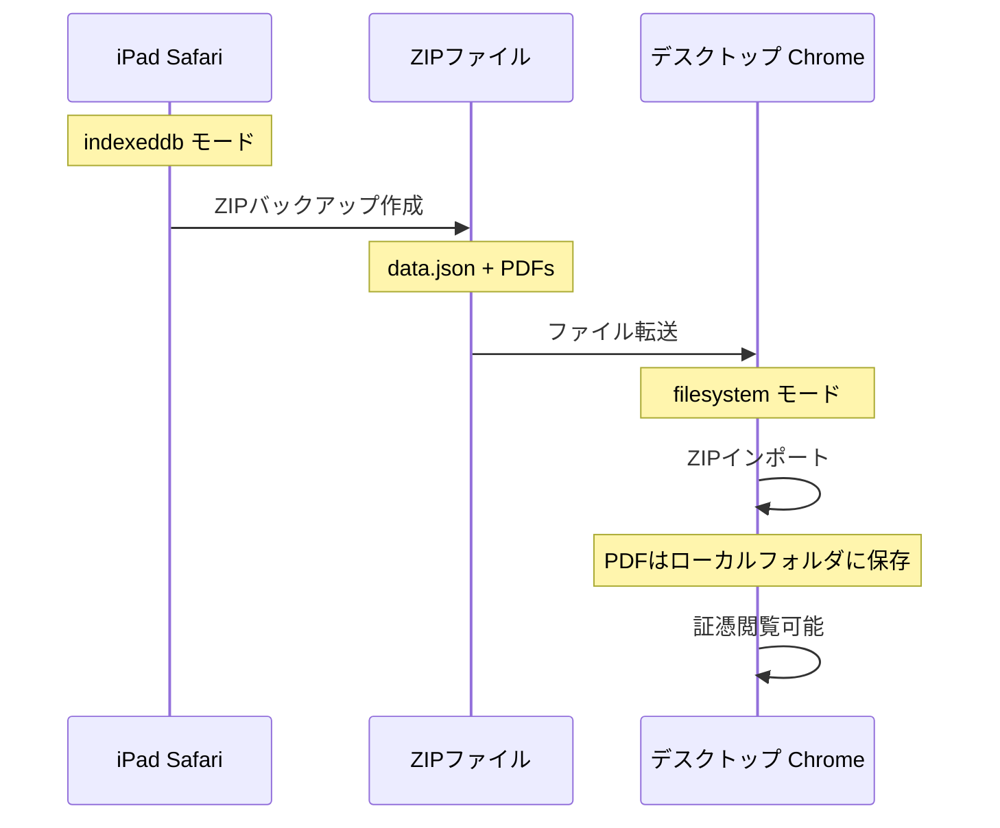

# データ・証憑ストレージ アーキテクチャ

e-shiwake のデータと証憑（PDF）の保存、エクスポート、インポートに関する技術ドキュメント。

## 目次

- [ストレージモード](#ストレージモード)
- [データ構造](#データ構造)
- [ユースケース](#ユースケース)
  - [証憑添付](#証憑添付)
  - [証憑閲覧](#証憑閲覧)
  - [JSONエクスポート](#jsonエクスポート)
  - [ZIPバックアップ](#zipバックアップ)
  - [JSONインポート](#jsonインポート)
  - [ZIPインポート](#zipインポート)
- [ストレージモード移行](#ストレージモード移行)

## ストレージモード

e-shiwake は2つのストレージモードをサポート。

| モード       | 対象環境                 | 証憑保存先           | API                    |
| ------------ | ------------------------ | -------------------- | ---------------------- |
| `filesystem` | デスクトップ Chrome/Edge | ローカルフォルダ     | File System Access API |
| `indexeddb`  | iPad Safari、その他      | ブラウザ内 IndexedDB | Dexie.js               |

### モード判定

```typescript
// 設定で明示的に選択、またはAPI対応状況で自動判定
const storageMode: 'filesystem' | 'indexeddb' = settings.storageType;
```

### 各モードの特徴

```
┌─────────────────────────────────────────────────────────────────┐
│                     filesystem モード                           │
├─────────────────────────────────────────────────────────────────┤
│  ブラウザ                        ローカルフォルダ                │
│  ┌──────────────┐               ┌──────────────────────┐       │
│  │ IndexedDB    │               │ e-shiwake/           │       │
│  │ ・仕訳データ  │               │ ├─ 2024/             │       │
│  │ ・勘定科目   │               │ │  ├─ 領収書_xxx.pdf │       │
│  │ ・取引先     │               │ │  └─ 請求書_yyy.pdf │       │
│  │ ・設定       │               │ └─ 2025/             │       │
│  │              │  filePath     │    └─ 領収書_zzz.pdf │       │
│  │ attachment:  │─────────────▶│                      │       │
│  │  filePath    │               └──────────────────────┘       │
│  │  (blob無し)  │                                              │
│  └──────────────┘                                              │
└─────────────────────────────────────────────────────────────────┘

┌─────────────────────────────────────────────────────────────────┐
│                     indexeddb モード                            │
├─────────────────────────────────────────────────────────────────┤
│  ブラウザ                                                       │
│  ┌──────────────────────────────────────────────────┐          │
│  │ IndexedDB                                        │          │
│  │ ・仕訳データ                                      │          │
│  │ ・勘定科目                                        │          │
│  │ ・取引先                                          │          │
│  │ ・設定                                            │          │
│  │                                                  │          │
│  │ attachment:                                      │          │
│  │  blob: Blob(PDF)  ◀── 証憑はDB内に保存           │          │
│  │  (filePath無し)                                  │          │
│  └──────────────────────────────────────────────────┘          │
└─────────────────────────────────────────────────────────────────┘
```

## データ構造

### Attachment（証憑）

```typescript
interface Attachment {
	id: string;
	journalEntryId: string;
	documentDate: string; // 書類の日付 YYYY-MM-DD
	documentType: DocumentType; // 'receipt' | 'invoice' | 'bill' | ...
	originalName: string; // 元のファイル名
	generatedName: string; // 自動生成ファイル名
	mimeType: string;
	size: number;
	description: string;
	amount: number;
	vendor: string;

	// ストレージモードにより異なる
	storageType: 'filesystem' | 'indexeddb';
	blob?: Blob; // indexeddb モード時のみ
	filePath?: string; // filesystem モード時のみ

	createdAt: string;
}
```

### ExportData（エクスポートデータ）

```typescript
interface ExportData {
	version: string;
	exportedAt: string;
	fiscalYear: number;
	journals: JournalEntry[]; // attachments含む（blob除外）
	accounts: Account[];
	vendors: Vendor[];
	settings: Settings;
}
```

## ユースケース

### 証憑添付

PDFを仕訳にドラッグ＆ドロップして添付する。



### 証憑閲覧

添付済みPDFをクリックしてプレビュー表示。



### JSONエクスポート

仕訳データのみをJSONでエクスポート（証憑PDFは含まない）。



### ZIPバックアップ

仕訳データ + 証憑PDFを完全バックアップ。



**ZIPファイル構造:**

```
e-shiwake_backup_2024.zip
├── data.json                              # 仕訳・勘定科目・取引先・設定
└── evidences/                             # 証憑PDF（ID安全な階層）
    ├── 2024/
    │   ├── {journalId}/
    │   │   ├── {attachmentId}/
    │   │   │   └── 2024-01-15_領収書_USBケーブル_3980円_Amazon.pdf
    │   │   └── ...
    │   └── ...
    └── ...
```

### JSONインポート

JSONファイルから仕訳データを復元（証憑PDFは復元されない）。



### ZIPインポート

ZIPファイルから仕訳データ + 証憑PDFを完全復元。



## ストレージモード移行

### filesystem → indexeddb

デスクトップからiPadへの移行など。



### indexeddb → filesystem

iPadからデスクトップへの移行など。



## 重要な注意点

### JSONエクスポート/インポートの制限

- **証憑PDFは含まれない**: JSONには仕訳データのみ
- **移行時は注意**: JSONインポート後、証憑は閲覧不可
- **推奨**: 完全バックアップにはZIPを使用

### ZIPバックアップ後のデータ安全性

```
┌─────────────────────────────────────────────────────────────┐
│ ZIPインポート完了後                                            │
├─────────────────────────────────────────────────────────────┤
│                                                             │
│  ZIPファイル           ブラウザ（IndexedDB）                   │
│  ┌─────────────┐      ┌─────────────────────────────┐       │
│  │ data.json   │      │ 仕訳データ ✓                  │      │
│  │ evidences/  │ ──▶  │ 証憑Blob ✓                   │      │
│  │  ├─ a.pdf   │      │                             │      │
│  │  └─ b.pdf   │      │ ※完全に独立したコピー          │      │
│  └─────────────┘      └─────────────────────────────┘      │
│        ↓                                                    │
│   削除可能 ✓                                                 │
│                                                             │
└─────────────────────────────────────────────────────────────┘
```

- インポート後、データはブラウザ内に完全保存
- 元のZIPファイルは削除しても問題なし
- 再バックアップは「ZIPバックアップ」で新規作成

### ストレージ容量

| モード     | 容量制限                    | 対策                         |
| ---------- | --------------------------- | ---------------------------- |
| indexeddb  | ブラウザ依存（通常 数GB〜） | 古い年度をエクスポート後削除 |
| filesystem | ディスク容量次第            | 特に制限なし                 |
