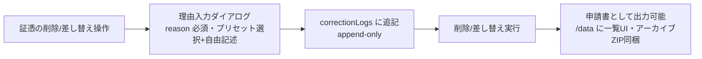
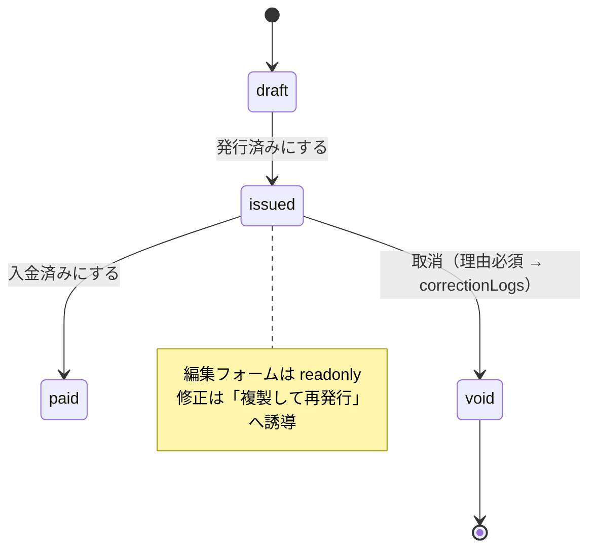

# 訂正・削除ワークフロー（4号規程のアプリ内運用）設計メモ

> 事務処理規程（規則4条1項4号）が要求する「取引情報訂正・削除申請書」の運用をアプリが肩代わりし、授受済みデータの意図しない訂正・削除を構造的に防ぐ。証憑の削除・差し替えと請求書発行後の編集は「授受済みデータをイミュータブルに扱う」という同一の設計原則の2つの現れとして、本メモで一括設計する。

状態: **構想メモ（2026-07-13 時点、未実装）**

## 1. 位置づけ（重要）

本設計は規則4条1項**3号**（訂正削除できないシステム）の充足を主張するものでは**ない**。ローカルアプリは本人が DevTools で IndexedDB を書き換えられる以上、3号の実効性はない（`evidence-integrity.md` §1 で不採用済み）。

本設計の狙いは **4号（事務処理規程）の「運用実態」をアプリで支援する**こと:

- 規程が禁じる操作（証憑の訂正・削除）をユーザーが無自覚に行えないようにする
- 規程が要求する「申請書」を、操作フローの中で自動生成・保存する
- 法的充足はあくまで規程の備付け + 運用。アプリは運用を確実・省力化する道具

## 2. 規程の対象になる操作の整理

規程が縛るのは**授受した電子取引データ（証憑PDF・発行控えPDF の中身）の訂正・削除**のみ。仕訳データは自己作成の帳簿記録であり対象外。

| e-shiwake の操作 | 規程の対象 | 理由 |
| --- | --- | --- |
| 証憑の削除（removeAttachment） | **対象** | 取引関係情報の「削除」 |
| 証憑の差し替え（削除→再添付） | **対象** | 「訂正」に相当 |
| 証憑のリネーム（仕訳修正に伴う自動リネーム含む） | 対象外 | ファイル名はメタデータ。PDF のバイト列は不変 |
| 仕訳の金額・日付・摘要の修正/削除 | 対象外 | 帳簿側の操作 |
| アーカイブ後の年度データ削除 | 対象外※ | アーカイブ ZIP に証憑保存済みなら保存場所の移動。※ZIP 保存が条件 |
| 容量管理の Blob 削除（blobPurgedAt） | 対象外※ | 同上。エクスポート済みが条件 |
| **請求書の発行後編集 → PDF 再生成** | **対象** | 交付済み取引情報の「訂正」。発行側も電帳法7条の対象（一問一答 問30） |

### 発行側（請求書）の根拠

電子帳簿保存法一問一答【電子取引関係】問30:
「請求書や領収書等を電子的に（データで）受け取ったり送付した場合については、データのまま保存しなければならないこととされており（法７）」

- メール等で送付した請求書 PDF は**発行控えも電子取引データ**（真実性・検索要件つき保存義務）
- 保存すべきは「実際に送付した PDF そのもの」。ブラウザ印刷経由の PDF は生成ごとにバイト列が変わるため「後で再生成すればよい」は成立しない
- 紙郵送のみの場合は電子取引に該当せず対象外

## 3. スコープ1: 証憑の削除・差し替え → correctionLogs

### 3.1 UI フロー



- 現行の「証憑を削除しますか？」AlertDialog（`JournalRowDialogs.svelte`）を理由必須フォームに置き換える
- 理由プリセット例: 「誤添付（別取引の書類）」「重複添付」「差し替え（正しい書類に交換）」+ 自由記述
- correctionLogs には**更新・削除の API も UI も作らない**（追記専用）

### 3.2 CorrectionLog 型（案）

```typescript
interface CorrectionLog {
	id: string; // UUID
	appliedAt: string; // 申請日 = 実行日時 ISO8601
	targetType: 'attachment' | 'invoice';
	journalEntryId?: string;
	attachmentId?: string;
	invoiceId?: string;
	// 対象仕訳のスナップショット（仕訳が後で削除されてもログ単体で申請書が成立するように）
	journalDate: string; // 取引日 YYYY-MM-DD
	vendor: string; // 取引先名
	description: string; // 摘要（取引件名）
	fileName: string; // 対象証憑の generatedName
	action: 'delete' | 'replace';
	detail: string; // 訂正・削除内容（自動生成: 「証憑PDFの削除: {fileName}」等）
	reason: string; // 訂正・削除理由（ユーザー入力・必須）
	operator: string; // 処理担当者名（事業者情報の氏名から自動）
	sha256Before?: string; // 差し替え前ハッシュ（evidence-integrity Phase 2 導入後）
	sha256After?: string; // 差し替え後ハッシュ
}
```

### 3.3 申請書8項目とのマッピング

| 申請書の項目（国税庁ひな型） | CorrectionLog |
| --- | --- |
| 一 申請日 | `appliedAt` |
| 二 取引伝票番号 | `journalEntryId`（+ `journalDate` で人間可読に） |
| 三 取引件名 | `description` |
| 四 取引先名 | `vendor` |
| 五 訂正・削除日付 | `appliedAt` |
| 六 訂正・削除内容 | `detail` |
| 七 訂正・削除理由 | `reason` |
| 八 処理担当者名 | `operator` |

出力形式: Markdown / CSV。`/data` ページに「訂正・削除記録」カードを追加して一覧・出力。アーカイブ ZIP 生成時に該当年度分を `correction-logs.csv` として自動同梱。

## 4. スコープ2: 請求書の発行後ロック

### 4.1 ステータス遷移



- `InvoiceStatus` に `'void'`（取消）を追加: `'draft' | 'issued' | 'paid' | 'void'`
- `issued` / `paid` / `void` では編集フォームを readonly 化。編集ボタンの代わりに「複製して再発行」（既存 `invoice-copy.ts`、複製後 `draft`・新番号）を提示
- `void` にする際は理由必須 → correctionLogs（`targetType: 'invoice'`）に記録。**void でも削除はしない**
- 旧データ移行: 既存の `issued`/`paid` はそのまま（スキーマ変更不要。union 拡張のみ）

### 4.2 発行アクションの一体化（送付版 = 保存版の保証）

「発行済みにする」を単なるステータス変更から、以下の1アクションに拡張する:

1. PDF Blob を生成
2. 売掛金仕訳（`journalId`）に証憑として自動添付（SHA-256 記録）
3. **同一の Blob** をユーザーにダウンロード提供（メール添付用）

これで送付するファイルと保存される控えが同一バイト列になり、発行側の真実性リスク（送付版と控えの乖離）が構造的に消える。

> **技術課題**: 現行の PDF 生成はブラウザ印刷（`window.print`）のため Blob を取得できず、生成が非決定的。一体化には PDF 生成ライブラリ（pdf-lib / jsPDF 等）への移行が必要で、和文フォント埋め込み（サイズ・ライセンス）の検証が要る。Phase を分けて先行検証する。

## 5. DB スキーマ変更（Dexie v10）

```typescript
this.version(10).stores({
	// ...既存テーブルは変更なし...
	correctionLogs: '&id, appliedAt, targetType, journalEntryId, invoiceId'
});
```

- `Attachment.sha256`（`evidence-integrity.md` Phase 2）を**同じ v10 に相乗り**させ、マイグレーションを1回にまとめる
- 既存証憑への遡及ハッシュ計算は evidence-integrity 側の未決事項に従う（filesystem モードは再読込許可が必要）
- `InvoiceStatus` の `'void'` 追加はインデックス変更不要

## 6. 実装フェーズ（案）

| Phase | 内容 | 備考 |
| --- | --- | --- |
| 0 | 証憑削除ダイアログに暫定注意書き1行 + ヘルプリンク | Phase 2 実装までの橋。コストほぼゼロ |
| 1 | Dexie v10: `correctionLogs` + `Attachment.sha256` | evidence-integrity Phase 2 と同時実施 |
| 2 | 削除・差し替えダイアログの理由必須フォーム化 + ログ記録 | スコープ1 の本体 |
| 3 | `/data` に訂正・削除記録の一覧・出力 UI + アーカイブ ZIP 同梱 | 申請書の実体化 |
| 4 | 請求書 issued ロック + `void` + 複製再発行導線 | スコープ2 前半 |
| 5 | PDF 生成ライブラリ検証 → 発行アクション一体化 | スコープ2 後半。技術検証が先 |

## 7. 未決事項

- 理由プリセットの語彙（税務調査時に通用する表現に統一したい）
- `operator` の扱い: 事業者情報未設定時のフォールバック（空欄可とするか入力必須とするか）
- 請求書 `note`（備考）は PDF に印字されるため issued 後ロック対象に含めるか
- correctionLogs のバックアップ/リストア対応（BackupData への追加。追記専用の性質とリストア上書きの整合）
- アーカイブ済み年度の証憑を削除した場合のログの帰属年度（`journalDate` の年度に帰属させる想定）
- Phase 5 の PDF ライブラリ選定: pdf-lib + 日本語サブセットフォント埋め込みのバンドルサイズ影響

## 8. 関連

- `docs/design/evidence-integrity.md` — ハッシュマニフェスト + 外部タイムアンカー（改ざん検出・時刻証明の補強層。本メモとは v10 マイグレーションを共有）
- `src/routes/help/evidence/content.md` — 真実性の確保・事務処理規程・申請書記入例（2026-07-13 整備済み）
- `src/lib/components/journal/JournalRowDialogs.svelte` — 証憑削除確認ダイアログ（Phase 0/2 の改修対象）
- `src/lib/utils/invoice-copy.ts` — 複製して再発行の既存実装
- 国税庁: [一問一答【電子取引関係】問30・問33](https://www.nta.go.jp/law/joho-zeikaishaku/sonota/jirei/pdf/03-6.pdf) / [各種規程等のサンプル](https://www.nta.go.jp/law/joho-zeikaishaku/sonota/jirei/0021006-031.htm)

> **免責**: 本メモは法的助言ではない。規程の整備・運用や要件充足の最終判断は税理士・所轄税務署に確認すること。
