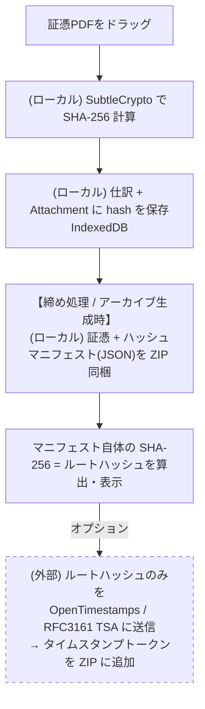

# 証憑インテグリティ（ハッシュマニフェスト + 外部タイムアンカー）設計メモ

> 「会計情報を外に出したくない。でも証憑はちゃんとしたい」を、規程（法的充足）+ ハッシュマニフェスト（改ざん検出）+ 任意の外部タイムアンカー（時刻証明）の 3 層で満たす。会計情報・証憑本体は一切外部に出さない。

状態: **構想メモ（2026-07-04 時点、未実装）**

## 1. 背景

AI チャット（v0.5.0）実装後の議論で、証憑の真実性強化について以下を検討した。

| 検討案                                                                      | 評価                                                                                                                                                       | 結論                          |
| --------------------------------------------------------------------------- | ---------------------------------------------------------------------------------------------------------------------------------------------------------- | ----------------------------- |
| Web Crypto API でユーザー固有鍵ペアを生成しローカル署名                     | 自己署名は「誰が」しか証明できず「いつ」を証明できない。鍵の保有者 = 改ざん動機を持ちうる本人なので第三者性ゼロ。バックデート署名が自由                    | ❌ 法的加点ゼロの装飾。不採用 |
| 「訂正削除できないイミュータブル設計」を仕様として主張（規則4条1項3号狙い） | 本人が DevTools で IndexedDB を書き換え・削除できるローカルアプリでは実効性がない。3号は利用者が改変できない管理主体分離（クラウド等）が前提               | ❌ 不採用                     |
| 外部電子契約サービス（ベクターサイン等）への誘導                            | 認定タイムスタンプ付与なら規則4条1項2号を充足。ただし証憑 PDF 本体をクラウドに預ける（思想と半分矛盾）+ 契約書向け価格で証憑保管には割高（1通 176〜440円） | △ ヘルプで紹介に留める        |
| **ハッシュマニフェスト + 任意の外部タイムアンカー**                         | 会計情報ゼロ流出で改ざん検出 + 時刻証明。法的充足は規程（4号）が担い、本機能は補強証拠                                                                     | ✅ **採用（本設計）**         |

## 2. 法的整理（電子帳簿保存法）

### 2.1 真実性要件は「いずれか一つ」で足りる

電子取引データの真実性確保（施行規則 4 条 1 項）は次のいずれか:

1. タイムスタンプ付与後の授受
2. 授受後速やかにタイムスタンプ付与
3. 訂正削除の事実・内容を確認できる／訂正削除できないシステムの使用
4. **訂正削除の防止に関する事務処理規程の備付けと運用** 👈 個人事業主の現実解

出典: [電子帳簿保存法施行規則 第4条第1項](https://laws.e-gov.go.jp/law/410M50000040043)

### 2.2 法令上の「タイムスタンプ」は認定 TSA 限定

規則 2 条 6 項 2 号ロにより、1号・2号の「タイムスタンプ」は**総務大臣が認定する時刻認証業務**によるものに限る。OpenTimestamps や非認定の格安 TSA は法令上のタイムスタンプに**該当しない**（→ 本設計のアンカーは法的要件の代替ではなく補強証拠の位置づけ）。

### 2.3 事前承認制度は存在しない

電帳法の事前承認制は令和3年度改正で廃止。「税務署が認めるか」は調査時の事後判定であり、見られるのは要件充足（規程の備付け・**運用実態**、検索性、見読性）のみ。

### 2.4 検索要件の免除枠

規則 4 条 1 項の括弧書きにより、**基準期間売上高 5,000 万円以下**の事業者は、電磁的記録のダウンロード要求（提示・提出）に応じられれば検索要件が免除される。e-shiwake は検索要件 3 項目（日付・金額・取引先、範囲・組合せ）に対応済みのため二重の余裕がある。

### 2.5 各層の役割分担

| 層                     | 役割                             | 法的位置づけ                            |
| ---------------------- | -------------------------------- | --------------------------------------- |
| 事務処理規程（+ 運用） | 真実性要件の充足                 | 規則4条1項4号（必須。これだけで足りる） |
| 検索・見読性           | 既存機能で対応済み               | 規則の検索・見読性要件                  |
| ハッシュマニフェスト   | 改ざん・破損の検出               | 法的判定の外側（補強証拠）              |
| 外部タイムアンカー     | 「その時点に存在した」の時刻証明 | 法的判定の外側（補強証拠）              |

> **注意**: ハッシュ層だけあっても規程がなければ要件を満たさない。逆に規程があればハッシュ層はなくても適法。

## 3. アーキテクチャ



- **外部に出るのはルートハッシュ（32 バイト）のみ**。証憑本体・仕訳・取引先名・金額は一切出ない
- RFC 3161 はもともとクライアントが**ハッシュだけを TSA に送る**プロトコルであり、この思想と整合する

### 3.1 ハッシュマニフェスト形式（案）

```json
{
	"version": "1.0.0",
	"generatedAt": "2027-01-15T10:00:00+09:00",
	"fiscalYear": 2026,
	"algorithm": "SHA-256",
	"files": [
		{
			"path": "evidence/2026-04-01_Amazon_3980.pdf",
			"sha256": "a1b2c3…",
			"journalId": "e47b1d54-…",
			"attachmentId": "…"
		}
	],
	"journalsSnapshotSha256": "…（journals.json のハッシュ）"
}
```

- マニフェストは `manifest.json` としてアーカイブ ZIP のルートに同梱
- 検証は「各ファイルのハッシュ再計算 → manifest と照合 → manifest 自体のハッシュ → タイムスタンプトークンと照合」の 2 段階

### 3.2 実装ポイント

- ハッシュ計算: `crypto.subtle.digest('SHA-256', buffer)`（ブラウザ標準、依存追加なし）
- 計算タイミング: 証憑添付時に算出し `Attachment` に `sha256` フィールドを追加（IndexedDB スキーマ変更 → Dexie バージョンアップ + 既存証憑への遡及計算マイグレーション）
- アーカイブ生成: 既存の `/archive`（年度決算パッケージ ZIP）に manifest 生成を追加するだけで載る
- OpenTimestamps: `opentimestamps` npm パッケージ（ブラウザ動作可）。カレンダーサーバーへハッシュのみ送信、Bitcoin ブロックチェーンにアンカー。無料
- RFC 3161 TSA: `freeTSA.org` 等の無料 TSA も選択肢（非認定なので法的タイムスタンプではない点は同じ）

## 4. 実装フェーズ（案）

| Phase     | 内容                                                                                                      | 備考                                                            |
| --------- | --------------------------------------------------------------------------------------------------------- | --------------------------------------------------------------- |
| 1         | 事務処理規程テンプレの案内 — `/help/evidence` に国税庁サンプル規程（個人事業主用）へのリンク + 解説を追加 | ✅ **実装済み（2026-07-13）**。導入3ステップ・申請書記入例・WARNING 強調まで反映 |
| 2         | `Attachment.sha256` 追加 + 添付時ハッシュ計算 + 既存分マイグレーション                                    | Dexie スキーマ変更（メジャー相当の慎重さで）                    |
| 3         | アーカイブ ZIP に `manifest.json` 同梱 + ルートハッシュの画面表示・コピー                                 | 既存アーカイブ機能の拡張                                        |
| 4         | 検証機能 — アーカイブ ZIP を読み込ませて全ハッシュ照合するローカル検証 UI                                 | 「自分で監査できる」体験                                        |
| 5（任意） | OpenTimestamps アンカー + トークン検証                                                                    | 外部送信はルートハッシュのみ。クラウド警告と同様のオプトイン UI |

## 5. 未決事項

- `Attachment.sha256` の遡及計算: filesystem モードの証憑（ファイル実体がローカルフォルダ）はブラウザから再読込の許可が必要
- manifest に journals スナップショットのハッシュまで含めるか（仕訳の改ざん検出まで射程に入れるか）
- OpenTimestamps の確定待ち時間（Bitcoin アンカーは数時間〜）の UX。pending トークン → 後日アップグレードのフロー
- Phase 5 の外部送信オプトイン文言（LLM チャットのクラウド警告と統一感を持たせる）

## 6. 関連

- `docs/design/correction-workflow.md` — 訂正・削除ワークフロー（4号規程のアプリ内運用。Phase 2 の `Attachment.sha256` は同メモの Dexie v10 マイグレーションと相乗り）
- `docs/design/llm-chat.md` — AI チャット設計（クラウド警告の思想を共有）
- `src/routes/help/evidence/content.md` — 証憑管理ヘルプ（Phase 1 の追記先）
- [電子帳簿保存法施行規則（e-Gov）](https://laws.e-gov.go.jp/law/410M50000040043)
- 国税庁: 電子帳簿保存法一問一答・各種規程サンプル（個人事業主用の事務処理規程）

> **免責**: 本メモは法的助言ではない。規程の整備・運用や要件充足の最終判断は税理士・所轄税務署に確認すること。
