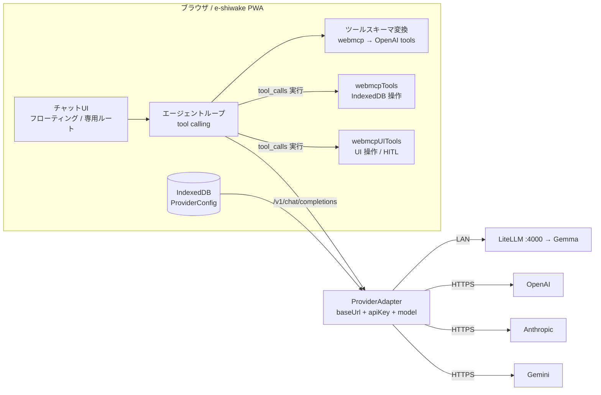
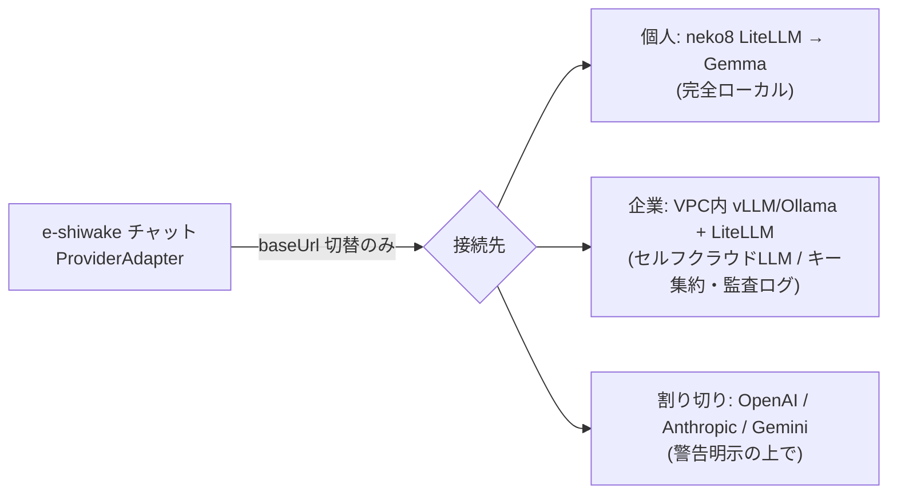
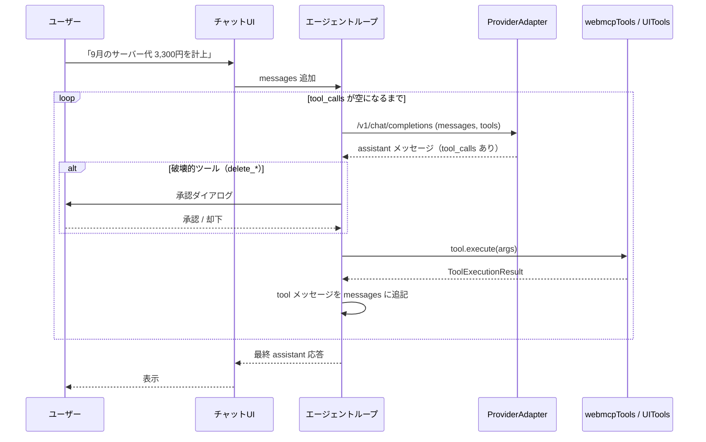
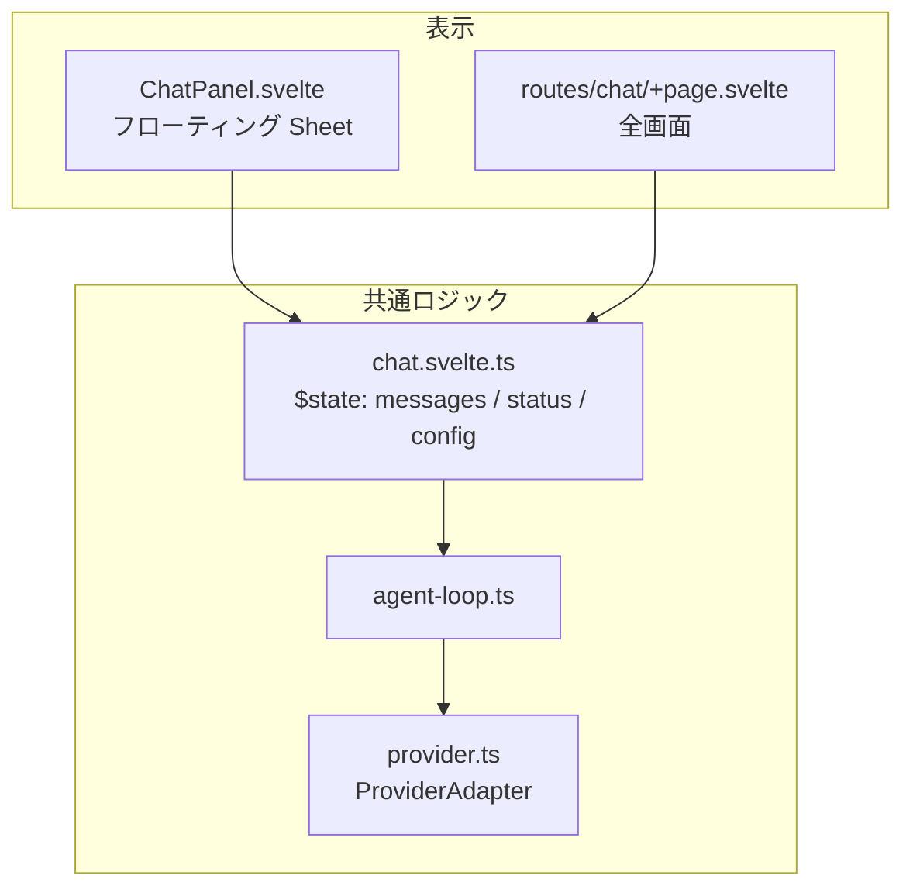
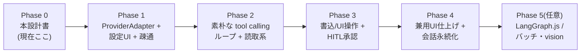

# LLM チャット（アプリ内コパイロット）設計

> e-shiwake の本番データ（IndexedDB）を、ローカル LLM・クラウド LLM のどちらからでも自然言語で参照・操作・分析できるアプリ内チャットを、`ProviderAdapter` + ブラウザ内エージェントループで実装する。

## 1. 背景

[Discussion #49](https://github.com/shuji-bonji/e-shiwake/discussions/49) での検討結果を設計に落とし込む。要点は以下のとおり。

- e-shiwake の WebMCP ツール（`src/lib/webmcp/tools.ts` / `ui-tools.ts`）は **プレーンな TS 関数**（`name` / `description` / `inputSchema` / `execute`）として定義済み。`navigator.modelContext` への登録は薄いラッパーに過ぎない。
- したがって **同じツール定義を 2 系統に供給**できる: ① 既存の WebMCP 登録（将来の外部エージェント用の口）、② 本設計のアプリ内チャット（`webmcpTools` を直接 import）。
- アプリ内チャットは `navigator.modelContext` 非依存のため **Chrome Canary のフラグに依存せず、iPad Safari でも動く**。
- 接続先を OpenAI 互換 `/v1/chat/completions` の `ProviderAdapter` で抽象化すれば、**個人ローカル（neko8 LiteLLM）→ クラウド割り切り → 企業セルフクラウド（VPC 内 vLLM/Ollama + LiteLLM）まで同一コードで射程に入る**。
- **プライバシーの非対称性はローカル LLM で解決するのが本命**。クラウド選択時は「帳簿データが外部送信される」警告を明示する（ユーザーの選択肢として許容）。

### スコープの確認（2026-06）

| 項目 | 決定 |
| --- | --- |
| 今回の成果物 | 本設計ドキュメント（実装は次フェーズ） |
| UI 配置 | **兼用設計** — フローティングパネル + 専用ルート `/chat` の両方からロジックを共用 |
| 対応プロバイダ | LiteLLM（ローカル Gemma） / OpenAI 互換汎用 / クラウド各社（OpenAI・Anthropic・Gemini） |

## 2. 設計方針

1. **ローカルファースト維持**: サーバー不要。API キーは端末内（IndexedDB）保存で外部に出さない。
2. **ツール定義は単一ソース**: `webmcpTools` / `webmcpUITools` を 1 箇所で定義し、WebMCP 登録とチャットの両方に供給。
3. **接続先は設定で差し替え**: `ProviderAdapter`（`baseUrl` + `apiKey` + `model` + `extraHeaders`）。e-shiwake 本体は接続先を知らない。
4. **エージェントループはブラウザ内・素朴実装**: 最初は `fetch` ベースの tool calling ループ（〜100 行）。LangGraph.js は当面不要。
5. **破壊的操作は human-in-the-loop**: `delete_*` 系は実行前にユーザー承認を挟む。
6. **クラウド送信は明示警告**: クラウドプロバイダ選択時、帳簿データ外部送信の警告を出す。

## 3. アーキテクチャ全体像



接続先の差し替えだけで、3 つの展開シナリオがすべて同一コードで動く。



## 4. ProviderAdapter

### 4.1 設定型

```typescript
// src/lib/llm/types.ts（新規）
export interface LLMProviderConfig {
  id: string;                          // 設定の識別子（UUID）
  label: string;                       // 表示名（例: "neko8 Gemma"）
  kind: 'local' | 'openai' | 'anthropic' | 'gemini' | 'custom';
  baseUrl: string;                     // 例: http://neko8:4000/v1
  apiKey: string;                      // 端末内のみ。空可（ローカル）
  model: string;                       // 例: gemma-smart / gpt-4o / claude-sonnet-4-6
  extraHeaders?: Record<string, string>;
  temperature?: number;
  isCloud: boolean;                    // 警告表示の判定に使用
}
```

### 4.2 プリセット

| プリセット | baseUrl 例 | apiKey | CORS | 備考 |
| --- | --- | --- | --- | --- |
| ローカル（LiteLLM/Ollama/vLLM/llamafile） | `http://neko8:4000/v1` | 不要 or 任意 | LiteLLM 側で許可設定 | **本命**。データが LAN から出ない |
| OpenAI | `https://api.openai.com/v1` | 必須 | 許可済み | クラウド警告対象 |
| Anthropic | `https://api.anthropic.com/v1` | 必須 | `anthropic-dangerous-direct-browser-access: true` を `extraHeaders` で付与 | クラウド警告対象 |
| Gemini | `https://generativelanguage.googleapis.com/v1beta/openai` | 必須 | 許可済み | OpenAI 互換エンドポイント。クラウド警告対象 |
| カスタム | 任意 | 任意 | 接続先依存 | 企業 VPC 等 |

> **CORS 留意点**: ブラウザから直接叩くため、ローカル LiteLLM 側に CORS 設定が必要。`litellm-langgraph-setup.md`（localllm-construction-practice）側に CORS 設定手順を追記する。

### 4.3 共通呼び出し I/F

```typescript
// すべてのプロバイダを OpenAI 互換 /v1/chat/completions で呼ぶ
async function chatCompletion(
  cfg: LLMProviderConfig,
  messages: ChatMessage[],
  tools: OpenAIToolSchema[]
): Promise<ChatCompletionResponse>;
```

## 5. エージェントループ

### 5.1 シーケンス



### 5.2 ツールスキーマ変換

既存の `WebMCPToolDefinition` は OpenAI の function tool 形式へそのまま機械変換できる（`inputSchema` が JSON Schema サブセットのため）。

```typescript
function toOpenAITool(t: WebMCPToolDefinition): OpenAIToolSchema {
  return {
    type: 'function',
    function: {
      name: t.name,
      description: t.description,
      parameters: t.inputSchema ?? { type: 'object', properties: {} }
    }
  };
}
```

### 5.3 ループ（擬似コード）

```typescript
const toolMap = new Map(allTools.map((t) => [t.name, t]));

while (true) {
  const res = await chatCompletion(cfg, messages, allTools.map(toOpenAITool));
  const msg = res.choices[0].message;
  messages.push(msg);

  if (!msg.tool_calls?.length) break;       // 通常応答 → 終了

  for (const call of msg.tool_calls) {
    const tool = toolMap.get(call.function.name);
    const args = JSON.parse(call.function.arguments);

    if (isDestructive(call.function.name)) {  // delete_* / confirm_delete_*
      const approved = await requestApproval(call.function.name, args);
      if (!approved) {
        messages.push(toolMessage(call.id, 'ユーザーが操作を却下しました'));
        continue;
      }
    }

    const result = await tool.execute(args);  // ← 既存 execute をそのまま呼ぶ
    messages.push(toolMessage(call.id, resultToText(result)));
  }
}
```

> `tool.execute` の戻り値は `ToolExecutionResult`（`content: ContentBlock[]`）。`text` を連結して tool メッセージ本文にする。

## 6. 公開ツール（既存定義を流用）

### 6.1 データ操作ツール（`webmcpTools`）

| ツール名 | 機能 | 破壊的 |
| --- | --- | --- |
| `search_journals` | 全年度横断の仕訳検索 | - |
| `get_journals_by_year` | 年度別仕訳一覧 | - |
| `create_journal` | 複合仕訳作成（借貸一致検証あり） | - |
| `delete_journal` | 仕訳削除 | ⚠️ |
| `list_accounts` | 勘定科目一覧 | - |
| `list_vendors` | 取引先一覧 | - |
| `generate_ledger` | 総勘定元帳 | - |
| `generate_trial_balance` | 試算表 | - |
| `generate_profit_loss` | 損益計算書 | - |
| `generate_balance_sheet` | 貸借対照表 | - |
| `calculate_consumption_tax` | 消費税集計 | - |
| `get_available_years` | 利用可能年度一覧 | - |

### 6.2 UI 操作ツール（`webmcpUITools`）

| ツール名 | 機能 | 備考 |
| --- | --- | --- |
| `navigate_to` | 指定ページへ遷移 | フォーム連携 |
| `open_journal_editor` | 仕訳エディタを開く（プリフィル可） | HITL（ユーザーが確定） |
| `set_search_query` | 検索クエリを設定 | - |
| `confirm_delete_journal` | 削除確認 UI を開く | HITL |
| `open_invoice_editor` | 請求書エディタを開く（プリフィル可） | HITL |

> UI 操作ツールは元々 Human-in-the-Loop パターン（AI はフォームを開くだけ、確定はユーザー）。チャットでもこの性質をそのまま活かす。

## 7. Human-in-the-Loop（破壊的操作の承認）

- **対象**: `delete_journal`（データ直接削除）。`confirm_delete_journal` は元々 UI 確認を経るため二重承認は不要。
- **方式**: ループ内で `delete_journal` の `tool_call` を検出したら、実行前に承認ダイアログを表示。却下時は tool メッセージに「却下」と記録して LLM に返す。
- 将来、複数ステップ計画（CSV→一括起票）や状態永続化が必要になった段階で LangGraph.js 化を検討。それまではブラウザ内ループで十分。

## 8. UI 設計（兼用：フローティング + 専用ルート）

ロジック（ループ・状態・設定）を共通モジュールに集約し、表示の殻だけを 2 つ用意する。



### 8.1 ファイル構成案

```
src/lib/llm/
├── types.ts              # LLMProviderConfig, ChatMessage, OpenAIToolSchema
├── provider.ts           # ProviderAdapter（chatCompletion）
├── agent-loop.ts         # tool calling ループ
├── tool-bridge.ts        # webmcp → OpenAI tools 変換 + execute ディスパッチ
├── config-store.ts       # ProviderConfig の IndexedDB 永続化
└── chat.svelte.ts        # チャット状態ストア（$state runes）

src/lib/components/chat/
├── ChatPanel.svelte      # フローティング（bits-ui Sheet）
├── ChatMessages.svelte   # メッセージ一覧（共通）
├── ChatInput.svelte      # 入力欄（共通）
├── ToolCallCard.svelte   # tool_call の実行表示
└── ApprovalDialog.svelte # 破壊的操作の承認

src/routes/chat/
└── +page.svelte          # 専用ルート（ChatMessages/ChatInput を再利用）

src/routes/settings/      # 既存に LLM プロバイダ設定を追加
```

### 8.2 状態管理（Svelte 5 runes）

- メッセージ・実行状態は `chat.svelte.ts` に `$state` で保持。`ChatPanel` と `/chat` の両方が同じストアを購読 → どちらで開いても会話が継続。
- IndexedDB 保存時は `JSON.parse(JSON.stringify(...))` でプレーン化（Svelte プロキシ対策。`structuredClone` は不可）。

### 8.3 設定 UI（`/settings` に追加）

- プロバイダのプリセット選択（ローカル / OpenAI / Anthropic / Gemini / カスタム）+ `baseUrl` / `apiKey` / `model` 入力。
- クラウド種別（`isCloud: true`）を選ぶと **「帳簿データが選択先プロバイダに送信されます」警告**を表示。
- 接続テストボタン（`/v1/models` or 軽い chat completion で疎通確認）。

## 9. 永続化・設定

| データ | 保存先 | 備考 |
| --- | --- | --- |
| ProviderConfig（複数可・アクティブ 1 つ） | IndexedDB | API キー含む。端末外に出さない |
| 会話履歴 | メモリ（`$state`）→ 任意で IndexedDB | 既定は揮発。残す場合のみ保存 |

## 10. プライバシー・セキュリティ

- **プライバシーの非対称性**: tool 実行結果（仕訳データ）はプロンプトに載りプロバイダへ送信される。ローカルファーストを謳うアプリのため、**クラウド選択時は外部送信の明示警告**を必須とする。
- **API キー保管リスク**: ブラウザ保存は XSS に弱い。e-shiwake は **サードパーティスクリプトなしの静的 PWA** のためリスクは低いが、ヘルプに注記する。
- **企業向けの選択肢**: クラウドキーを neko8 / VPC の LiteLLM 側に集約し、ブラウザにはキーを置かない構成も可能（`baseUrl` を LiteLLM に向けるだけ）。LiteLLM が **キー集約・レート制限・監査ログ**層になる。
- **精度の使い分け**: tool calling の安定性はクラウド勢が上。ローカル Gemma で精度不足の操作（複合仕訳の起票等）だけクラウドに切り替える運用を許容（`gemma-smart` / `gemma-fast` の使い分けも同様）。

## 11. e-shiwake-ai（SQLite 版 MCP）の位置づけ再定義

UI 経由チャットは本番データ（IndexedDB）を直接触れるため、SQLite 複製である e-shiwake-ai の役割は縮小する。残る役割は 2 つ。

| 役割 | 理由 |
| --- | --- |
| ブラウザ外エージェントの口 | Claude Desktop / Code / Cowork / neko8 の LangGraph.js は stdio MCP でしか繋がらない。ブラウザを開かず操作できるのはこちら |
| ヘッドレス自動化 | cron での月次レポート生成、CSV 一括投入などバッチ処理 |

位置づけ: **UI 経由 = 本命、e-shiwake-ai = ブラウザ外連携・実験場**。

## 12. 段階的実装計画



| Phase | 内容 | 検証ポイント |
| --- | --- | --- |
| 1 | `ProviderAdapter` + 設定 UI + 疎通テスト | ローカル/クラウドの両方で chat completion が通る |
| 2 | tool calling ループ + 読取系ツール（`search_journals` / `generate_*`） | 「今月の経費トップ5は？」が動く。Gemma の tool calling 精度を測る |
| 3 | 書込（`create_journal`）+ UI 操作 + `delete_journal` 承認 | 「サーバー代 3,300円計上」→ 承認フロー |
| 4 | フローティング + `/chat` の兼用、会話の継続・永続化 | iPad Safari 実機確認 |
| 5（任意） | LangGraph.js 化 / 月次バッチ / 証憑 PDF vision ドラフト | 複数ステップ・承認ノードが必要になったら |

## 13. 未決事項

- 会話履歴の既定保存方針（揮発 / 永続）。年度・データと無関係に持つか。
- ローカル Gemma の tool calling 精度（まず neko8 で `gemma-smart` を Phase 2 で実測）。
- システムプロンプト設計（勘定科目コード体系・消費税区分・複式簿記ルールの注入。`llms.txt` を要約して同梱するか）。
- クラウド警告の UX（毎回確認 / 設定時のみ / バナー常駐）。

## 14. 関連ドキュメント

- [Discussion #49 e-shiwake Local LLM活用](https://github.com/shuji-bonji/e-shiwake/discussions/49) — 本設計の一次資料
- `src/lib/webmcp/tools.ts` / `ui-tools.ts` — 流用するツール定義
- `src/routes/help/webmcp/content.md` — WebMCP の現状仕様
- localllm-construction-practice `macbookprom1pro/litellm-langgraph-setup.md` — LiteLLM/CORS 構築手順（CORS 追記予定）
