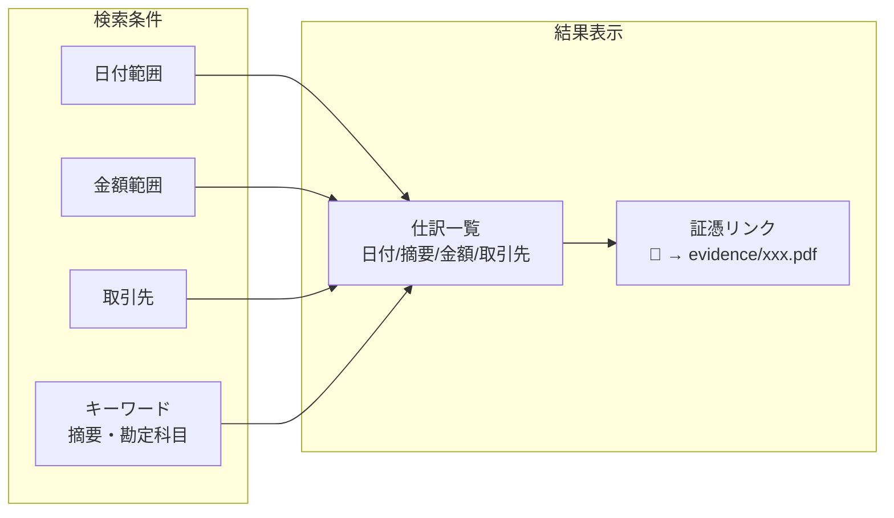
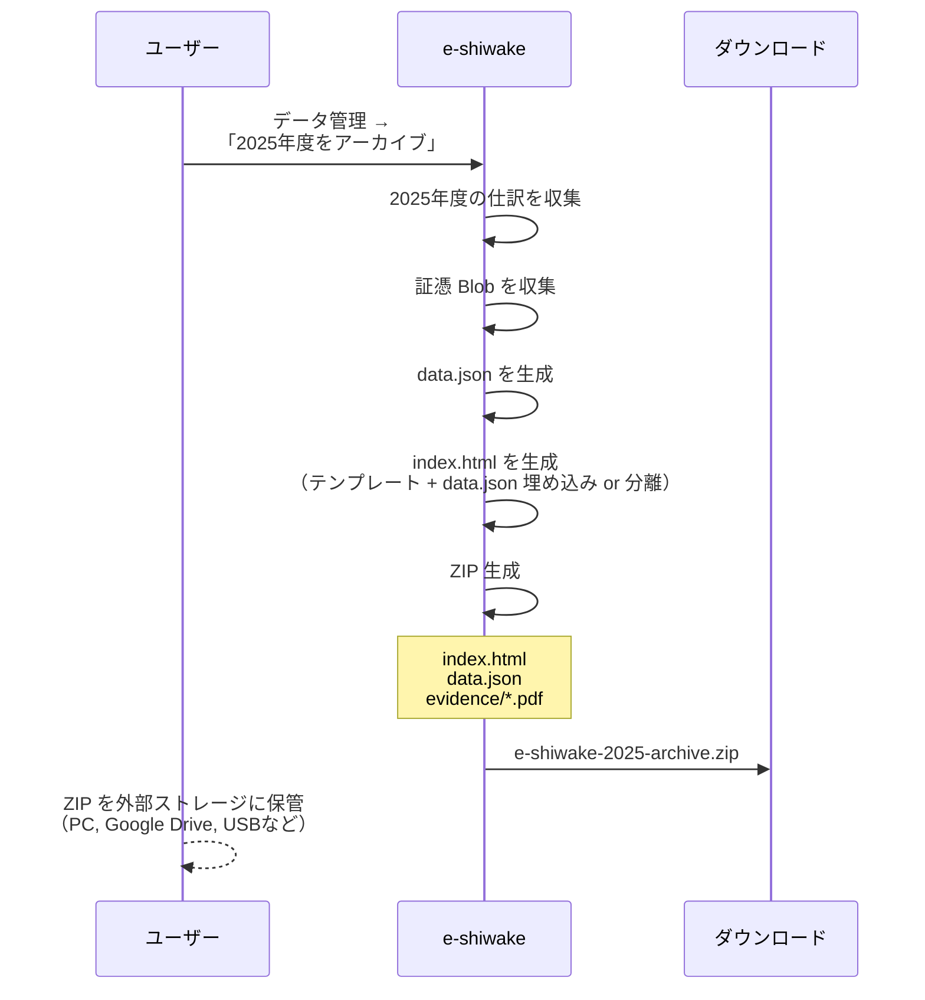
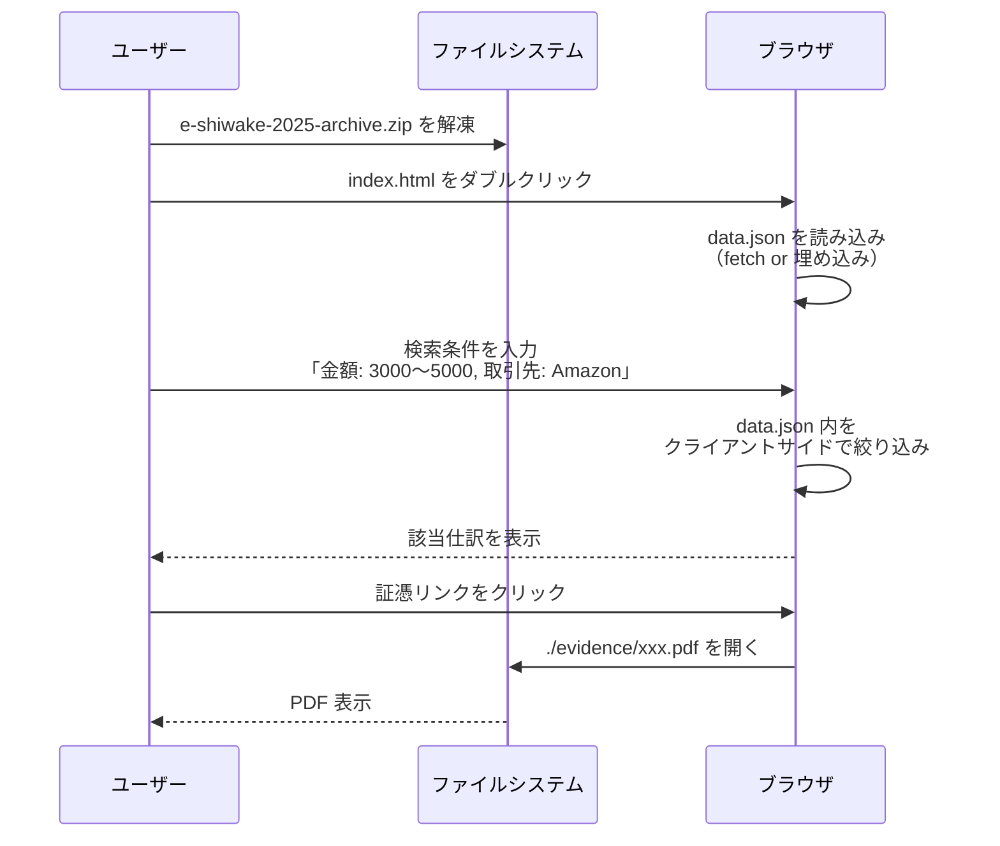
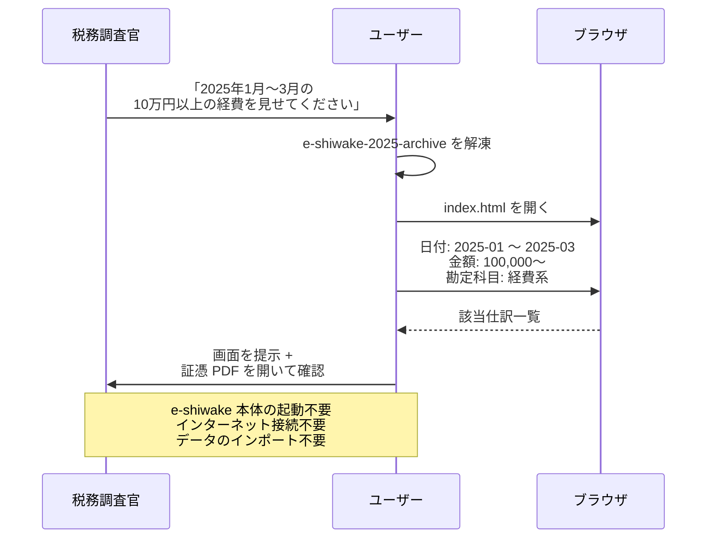
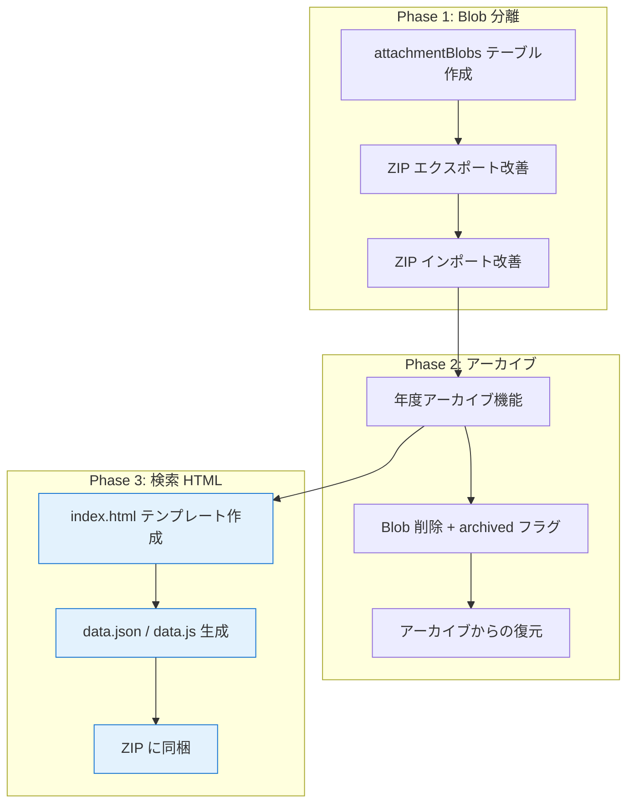

# 証憑アーカイブ ZIP に検索用 HTML を同梱する

## 概要

年度・上期下期などの単位で証憑をエクスポートする際、ZIP 内に**自己完結型の検索 HTML** を同梱する。ZIP を解凍してブラウザで `index.html` を開くだけで、仕訳・証憑を検索・閲覧できる。e-shiwake 本体への再インポートが不要になる。

## 背景と動機

- 確定申告後の過去年度データを再インポートする主な理由は「検索」
- 電帳法の検索要件（日付・金額・取引先）をオフラインで満たせる
- Safari の容量制限を考えると、過去データは「外」に出したい
- 出した後に検索手段がなくなるのが最大の不満点

## ZIP 構成

```
e-shiwake-2025-archive/
├── index.html              ← 検索UI（単一HTML、JS/CSS内蔵）
├── data.json               ← 仕訳 + 証憑メタデータ（閲覧専用）
└── evidence/
    ├── 2025-01-15_領収書_USBケーブル_3980円_Amazon.pdf
    ├── 2025-02-01_請求書_システム開発_500000円_○○株式会社.pdf
    └── ...
```

## index.html の機能

### 検索・フィルタ



| 検索項目   | 電帳法要件 | 備考                                  |
| ---------- | ---------- | ------------------------------------- |
| 日付範囲   | ✅ 必須    | カレンダーピッカー or YYYY-MM-DD 入力 |
| 金額範囲   | ✅ 必須    | from / to 指定                        |
| 取引先     | ✅ 必須    | テキスト部分一致                      |
| 摘要       | − 任意     | キーワード検索                        |
| 勘定科目   | − 任意     | セレクト or テキスト                  |
| 証憑の有無 | − 任意     | あり/なし/すべて                      |

### 仕訳表示（閲覧専用）

```mermaid
graph TD
    subgraph 仕訳一覧テーブル
        ROW[2025-01-15 | 消耗品費 / 普通預金 | USBケーブル | ¥3,980 | Amazon]
    end

    ROW -->|クリックで展開| DETAIL[仕訳詳細]

    subgraph DETAIL[仕訳詳細パネル]
        LINES[借方: 消耗品費 ¥3,619<br/>借方: 仮払消費税 ¥361<br/>貸方: 普通預金 ¥3,980]
        META[消費税区分: 課税仕入10%<br/>証跡: 電子]
        LINK[📎 2025-01-15_領収書_USBケーブル_3980円_Amazon.pdf]
    end

    LINK -->|クリック| PDF[evidence/xxx.pdf を<br/>ブラウザで開く]
```

- 編集機能は**一切なし**（読み取り専用）
- 仕訳の借方・貸方明細、消費税区分を表示
- 証憑リンクは相対パス（`./evidence/ファイル名.pdf`）

### 集計サマリー（おまけ）

- 勘定科目別の合計
- 月別推移
- 証憑カバー率（証憑あり仕訳 / 全仕訳）

> これらはあると便利だが、MVP では検索機能のみで十分。

## data.json の構造

```json
{
	"version": "1.0",
	"exportedAt": "2026-04-04T12:00:00.000Z",
	"app": "e-shiwake",
	"appVersion": "0.3.1",
	"fiscalYear": 2025,
	"period": {
		"start": "2025-01-01",
		"end": "2025-12-31",
		"label": "2025年度"
	},
	"accounts": [{ "code": "1001", "name": "現金", "type": "asset" }],
	"vendors": [{ "id": "xxx", "name": "Amazon" }],
	"journals": [
		{
			"id": "jrn-001",
			"date": "2025-01-15",
			"description": "USBケーブル購入",
			"lines": [
				{ "side": "debit", "accountCode": "5001", "amount": 3619, "taxCategory": "purchase_10" },
				{ "side": "debit", "accountCode": "1501", "amount": 361, "taxCategory": "none" },
				{ "side": "credit", "accountCode": "1002", "amount": 3980, "taxCategory": "none" }
			],
			"vendor": "Amazon",
			"evidenceStatus": "digital",
			"attachments": [
				{
					"id": "att-001",
					"generatedName": "2025-01-15_領収書_USBケーブル_3980円_Amazon.pdf",
					"documentType": "receipt",
					"size": 245000
				}
			]
		}
	],
	"summary": {
		"journalCount": 342,
		"attachmentCount": 198,
		"totalDebit": 12500000,
		"totalCredit": 12500000
	}
}
```

## ユーザーフロー

### フロー 1: 年度アーカイブ + 検索 HTML 生成



### フロー 2: アーカイブ後の検索



### フロー 3: 税務調査対応



## 技術的な検討事項

### index.html の実装方針

| 方式                                                                   | メリット           | デメリット                                            |
| ---------------------------------------------------------------------- | ------------------ | ----------------------------------------------------- |
| **data.json 埋め込み**<br/>（HTML 内に `<script>` で埋め込み）         | 単一ファイルで完結 | JSON が大きいと HTML が巨大に                         |
| **data.json 分離**<br/>（`fetch('./data.json')` で読み込み）           | HTML が軽量        | `file://` プロトコルで fetch が動かないブラウザがある |
| **data.json 分離 + フォールバック**<br/>（fetch 失敗時は手動読み込み） | 両方のメリット     | 実装が若干複雑                                        |

**推奨**: data.json 分離 + `<script>` タグでの読み込みフォールバック。

```html
<!-- data.json を JSONP 的に読み込む -->
<script>
	// fetch で読み込みを試み、失敗時は埋め込みデータを使用
	let appData;
</script>
<script src="./data.js"></script>
<!-- data.js: appData = { ...data.json の内容... }; -->
```

もしくは、仕訳数が少なければ（年間 500 件程度）HTML 埋め込みでも数百 KB 程度なので十分実用的。

### file:// プロトコルでの制約

| ブラウザ | fetch('./data.json')      | `<script src>` | 相対パス PDF リンク |
| -------- | ------------------------- | -------------- | ------------------- |
| Chrome   | ❌ CORS エラー            | ✅ 動作する    | ✅                  |
| Safari   | ❌ CORS エラー            | ✅ 動作する    | ✅                  |
| Firefox  | ✅ 同一ディレクトリなら可 | ✅ 動作する    | ✅                  |

→ `<script src="./data.js">` 方式なら全ブラウザで動作する。

### 証憑 PDF への相対リンク

```html
<a href="./evidence/2025-01-15_領収書_USBケーブル_3980円_Amazon.pdf" target="_blank">
	📎 領収書を表示
</a>
```

- `file://` プロトコルで相対パスの PDF リンクは全主要ブラウザで動作
- 日本語ファイル名も `encodeURIComponent` で対応可能

## 期間指定の選択肢

| 単位        | 用途                   | 備考                   |
| ----------- | ---------------------- | ---------------------- |
| 年度        | 確定申告後のアーカイブ | 最も一般的             |
| 上期 / 下期 | 容量対策で半期ごと     | Safari 向け            |
| 任意期間    | 税務調査の指定期間     | 柔軟だが UI が複雑     |
| 全期間      | 完全バックアップ       | ZIP が巨大になる可能性 |

**MVP では年度単位のみで十分**。半期・任意期間は後からの追加で良い。

## 改善案ドキュメントとの関係

この機能は [evidence-storage-improvement.md](./evidence-storage-improvement.md) の Blob 分離・年度アーカイブの**上位機能**として位置づける。



## 未解決の論点

1. **仕訳データの含め方**: data.json に全フィールドを含めるか、検索に必要な最小限にするか。セキュリティ的にはフルデータでも問題ない（ローカルファイルなので）が、ファイルサイズとの兼ね合い。

2. **index.html のスタイリング**: e-shiwake 本体と同じ見た目にするか、軽量な独自スタイルにするか。Tailwind のビルド済み CSS を埋め込むと数百 KB になる。最小限のインラインCSS が現実的。

3. **印刷対応**: 検索結果を紙に印刷する需要があるか。税務調査で「この一覧を印刷してください」と言われる可能性はある。`@media print` スタイルを含めるべきか。

4. **複数年度の統合検索**: 2024年と2025年のアーカイブを横断検索したい場合の対応。各 ZIP は独立なので、統合するには両方解凍して1つの HTML で読むか、年度ごとに別々に検索するか。初期は年度別で割り切る。
