# 証憑保存改善案 — シナリオ別フロー図

## 現状の問題整理

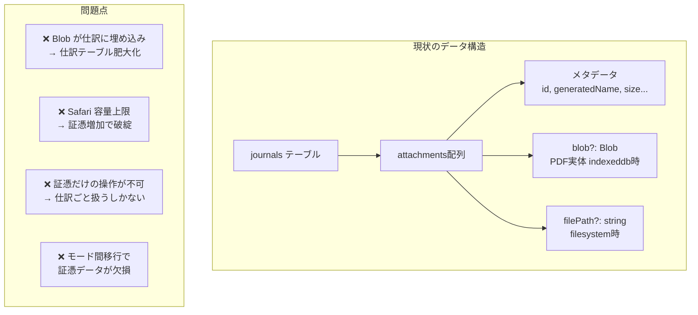

## 改善後のデータ構造

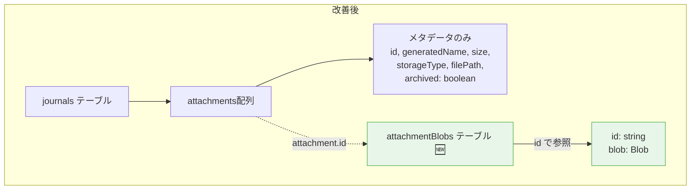

**ポイント**: 仕訳にはメタデータだけ。Blob は別テーブルに分離。

## シナリオ 1: 通常利用（Chrome デスクトップ / filesystem モード）

> 変更なし。今まで通り File System Access API で外部フォルダに保存。

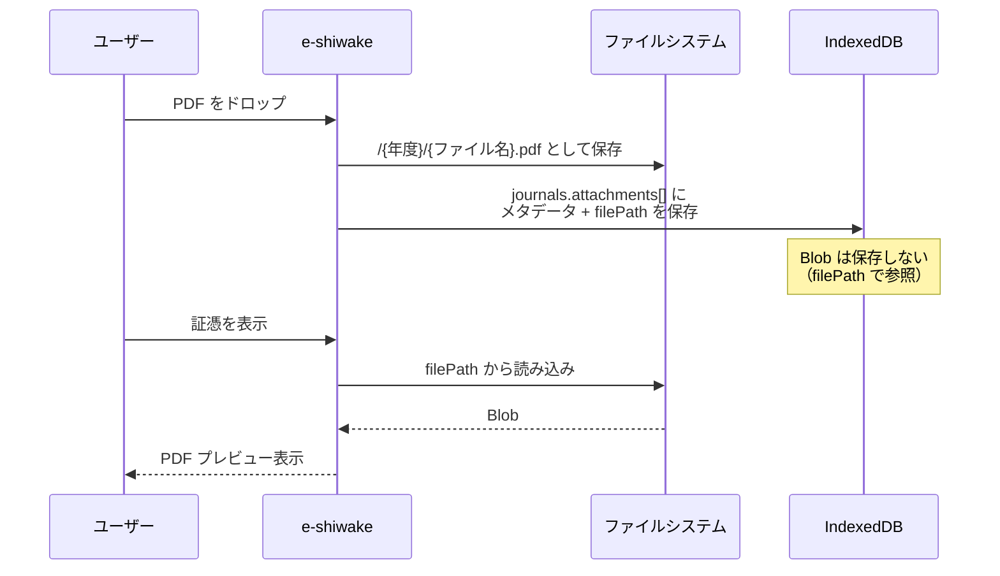

## シナリオ 2: 通常利用（Safari・iPad / indexeddb モード）

> **改善点**: Blob が仕訳から分離され、個別に操作可能に。

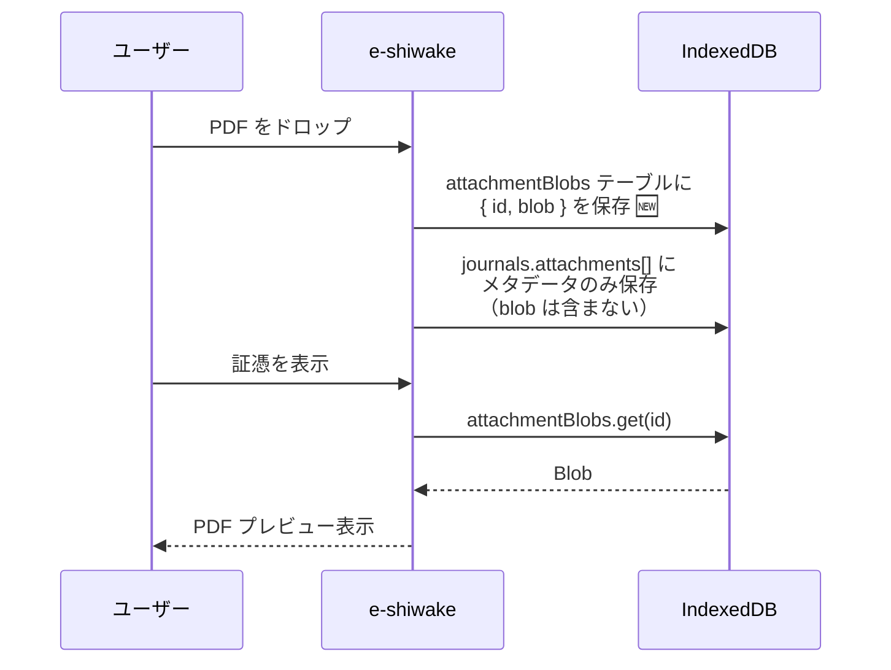

## シナリオ 3: 年度アーカイブ（Safari 容量対策）

> 古い年度の証憑 Blob を ZIP 出力後に IndexedDB から削除。メタデータは残る。

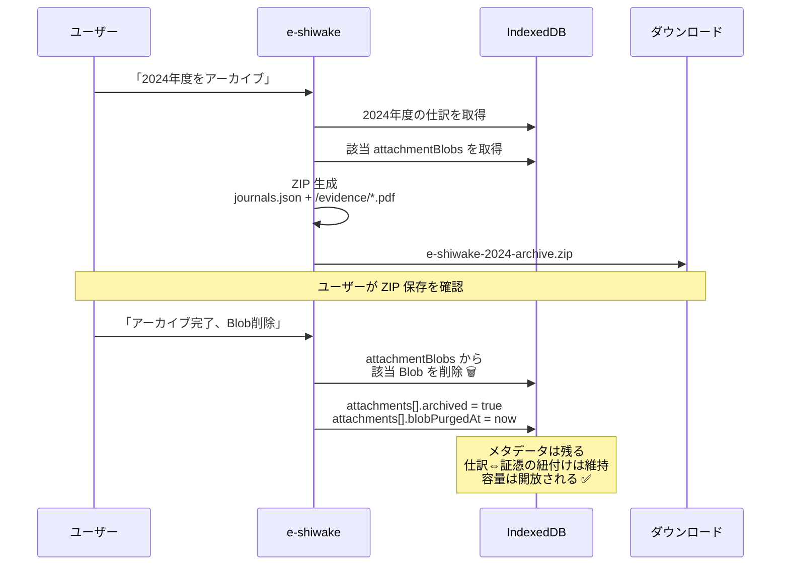

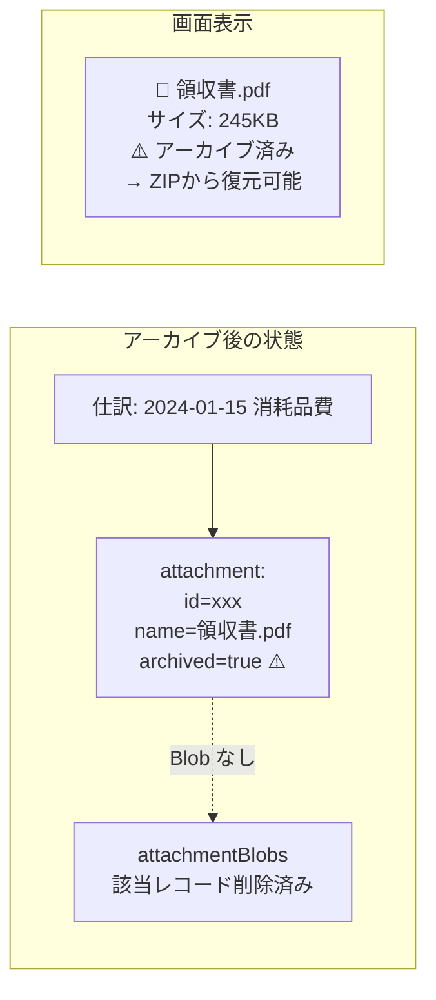

## シナリオ 4: アーカイブ ZIP からの復元

> ZIP をインポートし、Blob を IndexedDB に戻す。仕訳は既存なのでスキップ。

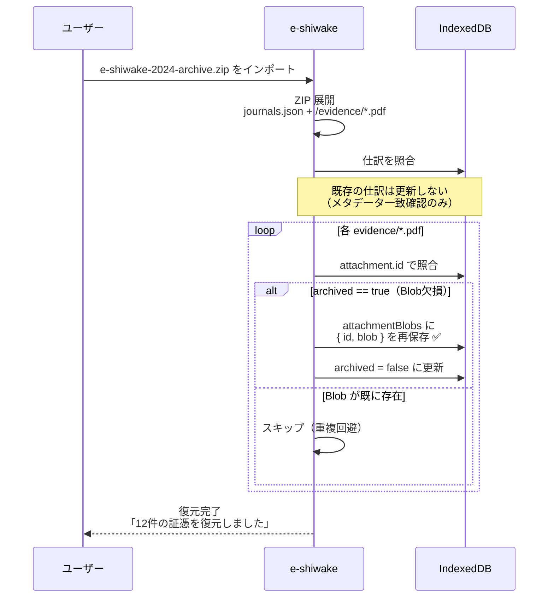

**ポイント**: 容量が足りない場合はここで警告を出す。全件ではなく選択的な復元も検討可。

## シナリオ 5: 端末移行（Safari → Safari）

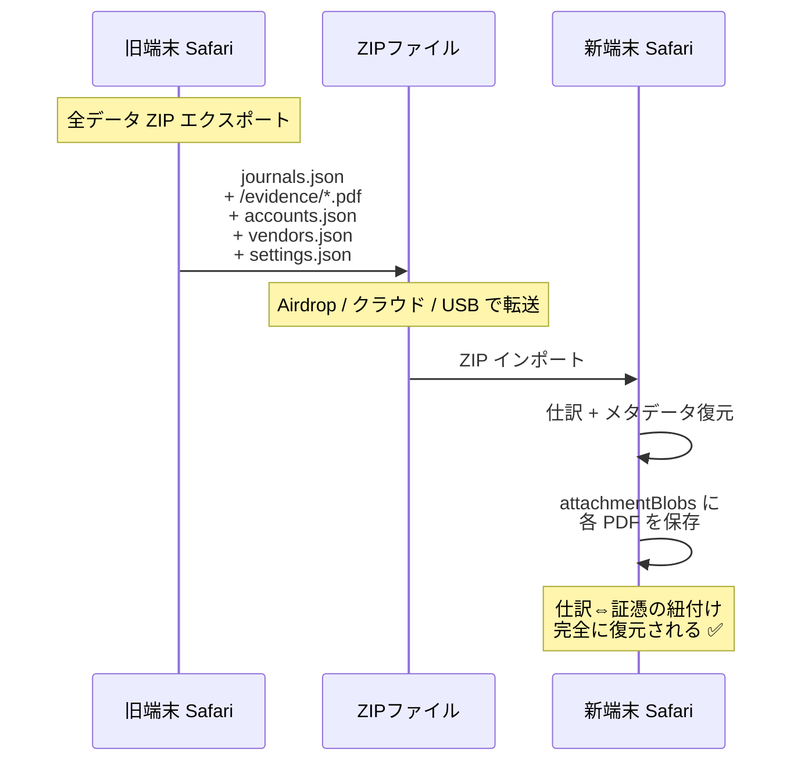

## シナリオ 6: クロスブラウザ移行（Chrome filesystem → Safari indexeddb）

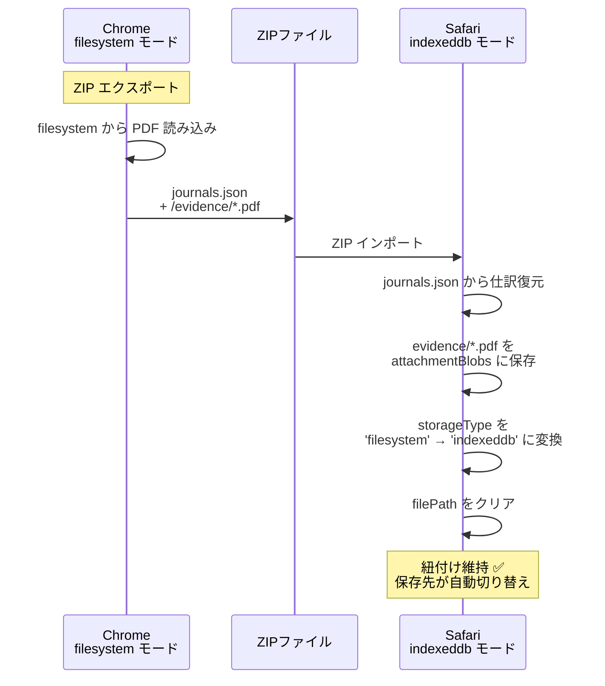

## シナリオ 7: クロスブラウザ移行（Safari indexeddb → Chrome filesystem）

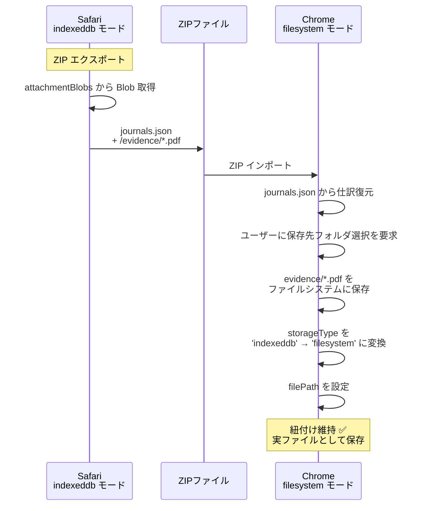

## シナリオ比較まとめ

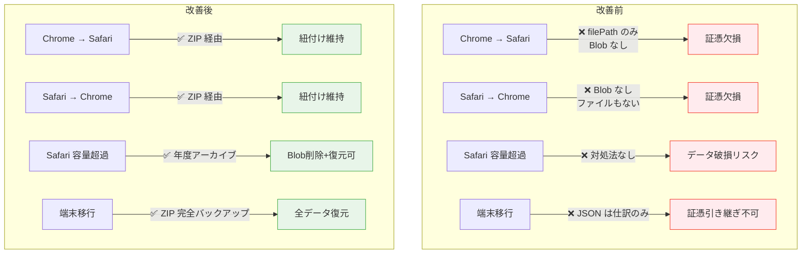

## 実装の優先順位案

| 優先度 | タスク                                            | 影響範囲                                 | 工数感 |
| ------ | ------------------------------------------------- | ---------------------------------------- | ------ |
| 🔴 高  | Blob 分離（attachmentBlobs テーブル作成）         | DB マイグレーション + 全 attachment 操作 | 中     |
| 🔴 高  | ZIP エクスポートに全証憑を含める                  | import-export.ts                         | 中     |
| 🔴 高  | ZIP インポートで証憑 Blob 復元 + storageType 変換 | import-export.ts                         | 中     |
| 🟡 中  | 年度アーカイブ機能（Blob 削除 + archived フラグ） | 新規 UI + repository                     | 中     |
| 🟡 中  | アーカイブ済み証憑の表示（⚠️ マーク + 復元導線）  | journal 編集 UI                          | 小     |
| 🟢 低  | 選択的 Blob 復元（ZIP 内から特定年度だけ復元）    | import UI                                | 小     |
| 🟢 低  | ストレージ使用量の詳細表示（年度別 Blob サイズ）  | data ページ UI                           | 小     |

## 未解決の論点

1. **DBマイグレーション**: 既存ユーザーの仕訳に埋め込まれた Blob を attachmentBlobs テーブルに移行する必要がある。Dexie の `.upgrade()` で対応可能だが、証憑が多いユーザーはマイグレーションに時間がかかる可能性。

2. **ZIP インポート時の容量チェック**: Safari でインポートする前に「この ZIP の証憑は合計 XXX MB です。現在の空き容量は十分ですか？」と確認するべきか。IndexedDB の空き容量取得は `navigator.storage.estimate()` で可能。

3. **部分復元の UI**: ZIP から全証憑を一括復元すると容量不足になる場合、年度単位や件数単位で選択復元する UI が必要。ただし初期リリースでは一括のみで十分か。

4. **archived 状態のエクスポート**: アーカイブ済み（Blob なし）の仕訳を JSON エクスポートしたとき、`archived: true` を含めるべきか。再インポート先で「この証憑はアーカイブ済みです」と表示できるように。
