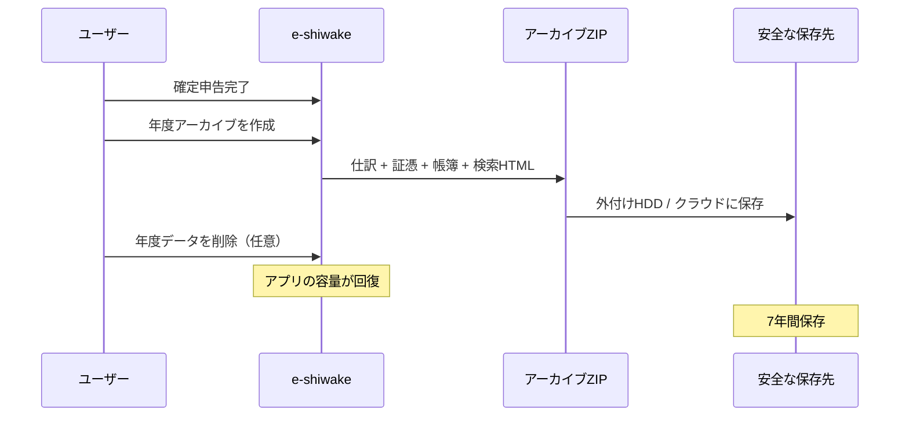
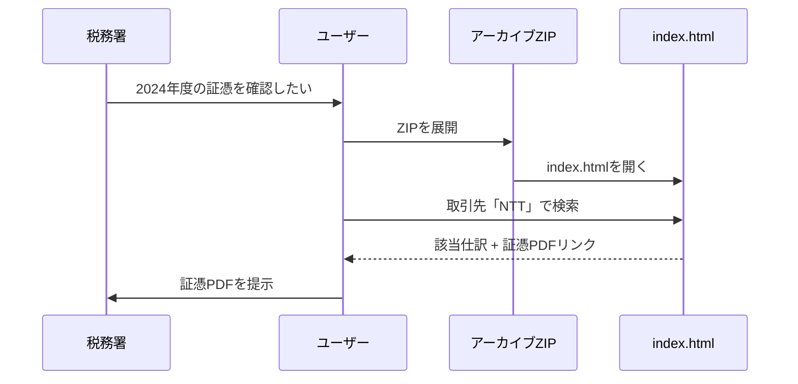
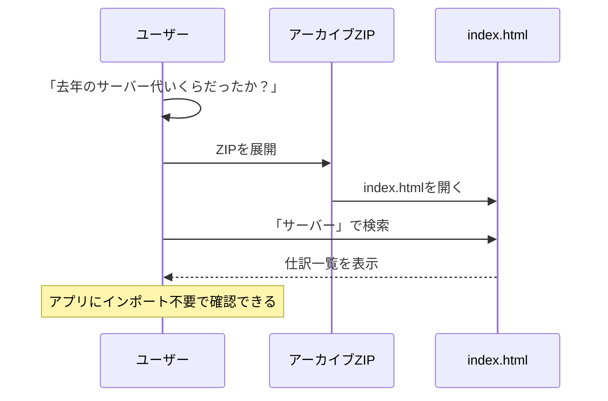

# 検索機能付アーカイブ保存

確定申告後に年度データを「封印」し、長期保存するための機能です。

## 概要

検索機能付アーカイブは、仕訳データ・証憑PDF・帳簿レポートを検索可能なHTMLファイルとともにZIPにまとめて保存する「年度決算パッケージ」です。
アプリにデータをインポートせずに、ZIPを展開するだけで過去のデータを検索・閲覧できます。

帳簿出力（`/reports`）が年度途中でも利用する「現在の帳簿」であるのに対し、アーカイブは確定申告後の「確定済み帳簿」をワンセットで長期保存するためのものです。

> **TIP**: アーカイブからリストアすると、年度の仕訳＋証憑をアプリに復活させることができます。フルバックアップからの復元も可能です。

## バックアップとの違い

| 項目                 | バックアップ             | 検索機能付アーカイブ                         |
| -------------------- | ------------------------ | -------------------------------------------- |
| 目的                 | 復元（リストア）するため | 閲覧・検索するため / 年度データ復活          |
| 証憑PDF              | ✅ 含む                  | ✅ 含む                                      |
| 検索HTML             | ―                        | ✅ 含む                                      |
| 帳簿レポート         | ―                        | ✅ HTML + CSV（6帳簿）                       |
| リストア対象         | 全データ（上書き）       | 仕訳＋証憑のみ（マージ）                     |
| アプリへの再取り込み | ✅ フルリストア          | ✅ アーカイブリストア / 閲覧                 |
| 編集                 | リストア後に編集可能     | リストアすれば編集可能 / ZIP内は読み取り専用 |
| 主な用途             | 端末移行、事故対策       | 年度締め、データ復活、税務調査対応           |

## アーカイブの構成

```
e-shiwake_2024_archive.zip
├── index.html              ← 検索・閲覧用HTML（オフライン動作）
├── data.json               ← 仕訳データ（機械可読）
├── reports/
│   ├── html/
│   │   ├── 仕訳帳_2024.html
│   │   ├── 総勘定元帳_2024.html
│   │   ├── 試算表_2024.html
│   │   ├── 損益計算書_2024.html
│   │   ├── 貸借対照表_2024.html
│   │   └── 消費税集計_2024.html
│   └── csv/
│       ├── 仕訳帳_2024.csv
│       ├── 総勘定元帳_2024.csv
│       ├── 試算表_2024.csv
│       ├── 損益計算書_2024.csv
│       ├── 貸借対照表_2024.csv
│       └── 消費税集計_2024.csv
└── evidences/
    └── 2024/
        ├── {仕訳ID}/{添付ID}/2024-01-15_領収書_通信費_8800円_NTT.pdf
        ├── {仕訳ID}/{添付ID}/2024-02-03_請求書_サーバー代_13200円_さくら.pdf
        └── ...
```

## 検索HTMLの機能

- 仕訳の一覧表示と検索（日付・金額・取引先・摘要）
- 勘定科目でのフィルタ
- 証憑PDFへのリンク（ZIP内の相対パス）
- 帳簿レポートへのリンク（HTML版）
- 完全オフライン動作（外部サーバー不要）
- レスポンシブデザイン（PC・タブレット対応）
- 印刷対応

## 同梱される帳簿レポート

| 帳簿       | HTML（印刷用） | CSV（データ連携用） |
| ---------- | -------------- | ------------------- |
| 仕訳帳     | ✅             | ✅                  |
| 総勘定元帳 | ✅（使用科目） | ✅                  |
| 試算表     | ✅             | ✅                  |
| 損益計算書 | ✅             | ✅                  |
| 貸借対照表 | ✅             | ✅                  |
| 消費税集計 | ✅             | ✅                  |

> **INFO**: 帳簿HTMLはブラウザで直接開いて印刷できます。CSVはExcelや他の会計ソフトへの連携に利用できます。

## アーカイブ後の年度データ削除

アーカイブZIP作成後、ブラウザのストレージ容量を節約するためにその年度のデータを削除できます。

- アーカイブ完了時に「年度データを削除」ボタンが表示されます
- 削除前に確認ダイアログが表示されます
- 削除は取り消せません。削除前にアーカイブZIPまたはバックアップZIPが安全な場所に保存されていることを確認してください

> **TIP**: 削除後に再編集が必要になった場合は、アーカイブからリストアで年度データを復活させてください。

## アーカイブからリストア

アーカイブZIP（または旧バックアップZIP）から年度の仕訳＋証憑を復元できます。

### リストア手順

1. アーカイブページの「アーカイブからリストア」セクションで「ZIPファイルを選択」
2. アーカイブZIPファイルを選択
3. プレビューを確認（年度・仕訳件数・新規追加数）
4. 証憑PDFの復元先を選択（証憑がある場合）
5. 「仕訳を復元」ボタンをクリック

### リストアの動作

- **仕訳＋証憑のみ**をマージ復元します
- 既存の仕訳IDと重複するものはスキップされます（上書きしない）
- **グローバルデータ**（勘定科目・取引先・固定資産・設定）は一切触りません

> **WARNING**: 削除してからアーカイブリストアした場合、仕訳で使用している勘定科目や取引先が現在の登録と異なる可能性があります。リストア後にデータの整合性をご確認ください。

### 旧バックアップZIPの扱い

v0.3.x以前の旧バックアップZIPもアーカイブリストアとして読み込めます。グローバルデータ（勘定科目・取引先・設定等）は無視され、仕訳＋証憑のみ復元されます。

> **WARNING**: 旧ZIPを読み込んだ場合、プレビュー画面に「v0.3.x以前のデータです」という目立つ警告が表示されます。事業者情報・勘定科目などの設定データを含む完全な復元が必要な場合は、先にデータ管理ページで**フルバックアップを作成**してください。

## ユースケース

### 確定申告後の年度締め



### 税務調査時の証憑提示



### 過去データの参照



## 電子帳簿保存法との関係

電帳法には2つの保存制度があり、アーカイブは両方に対応しています。

### 電子取引データ保存（第7条・義務）

電子取引データ（メール添付の請求書PDF等）は電子データのまま保存が必要です。

| 要件               | 対応                                 |
| ------------------ | ------------------------------------ |
| 取引年月日での検索 | ✅ 仕訳日付で検索可能                |
| 取引金額での検索   | ✅ 金額での検索・範囲指定            |
| 取引先での検索     | ✅ 取引先名で検索可能                |
| データの真実性確保 | ファイル名に日付・金額・取引先を含む |
| 7年間の保存        | ZIPファイルとして長期保存可能        |

### 電子帳簿保存（第4条・任意）

電子的に作成した帳簿の保存に対応。アーカイブには印刷可能なHTML形式とCSV形式の帳簿レポートが含まれます。

| 帳簿       | 対応          |
| ---------- | ------------- |
| 仕訳帳     | ✅ HTML + CSV |
| 総勘定元帳 | ✅ HTML + CSV |
| 試算表     | ✅ HTML + CSV |
| 損益計算書 | ✅ HTML + CSV |
| 貸借対照表 | ✅ HTML + CSV |
| 消費税集計 | ✅ HTML + CSV |

> **WARNING**: 電帳法の要件を完全に満たすには、タイムスタンプの付与や訂正削除の履歴管理が必要な場合があります。詳細は税理士にご相談ください。
