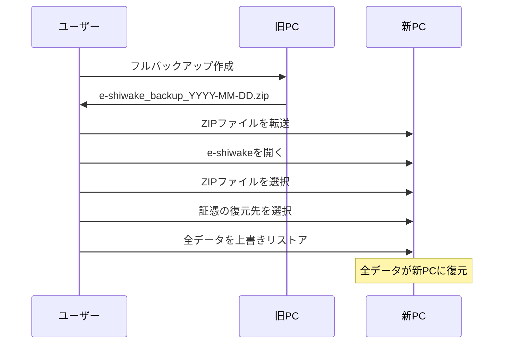
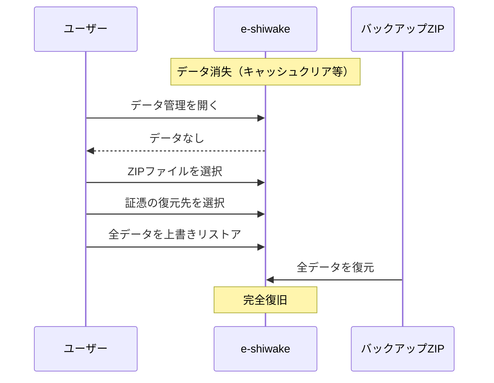

# バックアップ・リストア

データの完全な保全と復元を行います。端末移行や事故対策に使用してください。

## 概要

バックアップは、**全年度の全データ**をフルスナップショットとしてZIPファイルに保存します。
リストアは、バックアップZIPから**全データを上書き**で復元します（マージ復元はありません）。

年度別の仕訳・証憑を復活させたい場合は、[アーカイブからリストア](/help/archive)を使用してください。

## バックアップに含まれるデータ

| データ                       | スコープ | 含まれる |
| ---------------------------- | -------- | -------- |
| 仕訳                         | 全年度   | ✅       |
| 証憑PDF                      | 全年度   | ✅       |
| 請求書                       | 全年度   | ✅       |
| 勘定科目（ユーザー追加含む） | 全件     | ✅       |
| 取引先                       | 全件     | ✅       |
| 固定資産台帳                 | 全件     | ✅       |
| 事業者情報・青色申告設定     | 全件     | ✅       |
| アプリ設定                   | 全件     | ✅       |

## バックアップの作成

1. サイドバーの「データ管理」を開く
2. 「バックアップ作成」セクションで全体サマリを確認
3. 「フルバックアップ作成」ボタンをクリック
4. ZIPファイルがダウンロードされる

> **INFO**: 最終バックアップ日時がカード上部に表示されます。30日以上バックアップしていない場合は警告が表示されます。

> **TIP**: ファイル名は `e-shiwake_backup_YYYY-MM-DD.zip` の形式で保存されます。

## リストア（復元）

1. サイドバーの「データ管理」を開く
2. 「リストア（復元）」セクションで「ZIPファイルを選択」
3. バックアップZIPファイルを選択
4. プレビューを確認（含まれる年度・件数）
5. 証憑PDFの復元先を選択（証憑がある場合）
6. 「全データを上書きリストア」ボタンをクリック
7. 確認ダイアログで「上書きリストア実行」をクリック

> **WARNING**: フルリストアは**現在の全データを削除**してバックアップの内容で完全に置き換えます。この操作は元に戻せません。

### ZIP判別

バックアップページに年度別のアーカイブZIP（旧バックアップZIP含む）を読み込ませた場合、自動的にアーカイブページへ誘導されます。逆に、アーカイブページにフルバックアップZIPを読み込ませた場合はデータ管理ページへ誘導されます。

### 証憑PDFの復元先

ZIPに証憑PDFが含まれている場合、リストア時に復元先を選択する必要があります。
選択した保存先は**全年度**の `storageModeByYear` に一括適用されます。

| 保存先           | 対応ブラウザ | 特徴                                           |
| ---------------- | ------------ | ---------------------------------------------- |
| ローカルフォルダ | Chrome, Edge | ブラウザ容量を消費しない。フォルダの選択が必要 |
| ブラウザ内       | すべて       | 全ブラウザ対応。IndexedDB容量を消費する        |

> **INFO**: ブラウザ内保存を選択した場合、リストア前に証憑のサイズと現在のストレージ使用量が表示されます。容量不足のリスクがある場合は警告が表示されます。

> **WARNING**: Safari/Firefoxでは「ローカルフォルダ」は選択できません（File System Access API非対応）。ブラウザ内保存のみとなります。

### 設定の復元について

リストア時に復元される設定には、事業者情報・青色申告設定・Blob保持日数などが含まれます。
ただし、以下の設定はバックアップから復元されません（リストア先環境に依存するため）:

- 証憑の保存モード（`storageMode`, `storageModeByYear`）→ リストア時に選択
- 最終エクスポート日時（`lastExportedAt`）

## バックアップ・アーカイブの違い

| 項目             | バックアップ       | アーカイブ                         |
| ---------------- | ------------------ | ---------------------------------- |
| スコープ         | 全年度・全データ   | 年度別                             |
| リストア方式     | 上書きのみ         | マージのみ（仕訳+証憑）            |
| グローバルデータ | 復元される         | 復元されない                       |
| 主な用途         | 端末移行、事故対策 | 年度締め、データ復活、税務調査対応 |

## v0.4.0へのバージョンアップ時の注意

v0.4.0ではバックアップ方式が変更されました。**v0.3.x以前のバックアップZIPからは仕訳データのみ復元**されます（事業者情報・勘定科目・取引先・固定資産等の設定データは復元されません）。

> **WARNING**: v0.4.0にアップデートしたら、**真っ先にフルバックアップを作成**してください。これにより設定データを含む完全なバックアップを確保できます。

アプリ起動時に、バックアップ仕様変更の通知ダイアログが表示されます。「バックアップを作成する」ボタンからデータ管理ページに直接移動できます。この通知は「以降この通知を表示しない」にチェックを入れると非表示にできます。

## 後方互換

v0.3.x以前の旧バックアップZIPもインポートできます。旧バックアップはアーカイブリストア（年度の仕訳+証憑のみマージ復元）として処理されます。グローバルデータ（勘定科目・取引先・設定等）を含めて完全復元したい場合は、新フォーマットでバックアップを取り直してください。

## ユースケース

### PC買い替え時の端末移行

### ブラウザデータ消失からの復旧

> **WARNING**: バックアップは定期的に作成してください。電帳法により証憑は7年間の保存が必要です。
