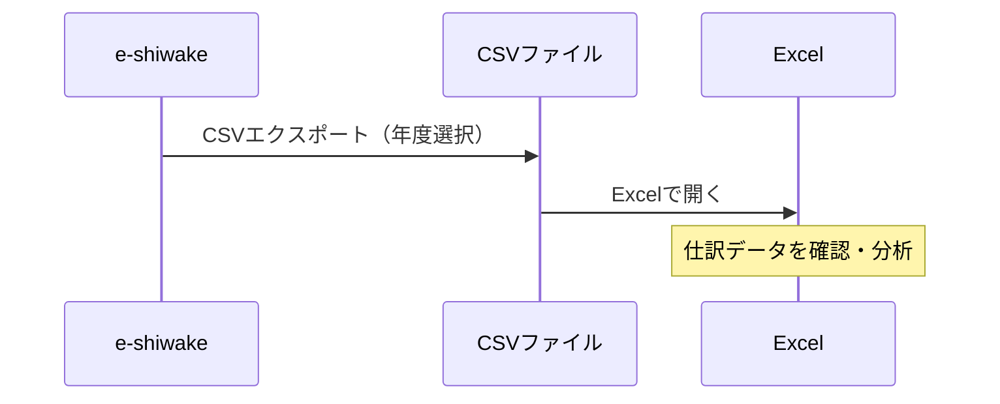

# エクスポート

仕訳データをCSVやJSON形式で出力します。Excelでの確認や他の会計ソフトへの連携に使用してください。

## 概要

e-shiwakeのデータ出力は3つのレイヤーに分かれています。エクスポートはそのうちの1つです。

| レイヤー         | スコープ         | 含む内容                                          | リストア                        |
| ---------------- | ---------------- | ------------------------------------------------- | ------------------------------- |
| バックアップ     | 全年度・全データ | 仕訳+証憑PDF+勘定科目+取引先+固定資産+請求書+設定 | 上書きリストア                  |
| アーカイブ       | 年度別           | 仕訳+証憑+帳簿レポート+検索HTML                   | マージリストア（仕訳+証憑のみ） |
| **エクスポート** | **年度別**       | **仕訳データのCSV/JSON出力**                      | **リストア不可**                |

エクスポートは、Excelでの確認や他の会計ソフトへの連携など、**外部利用を目的としたデータ出力**です。

| 機能             | 目的                                   |
| ---------------- | -------------------------------------- |
| CSVエクスポート  | Excelでの確認、他の会計ソフトへの連携  |
| JSONエクスポート | 仕訳データの外部保存（証憑を含まない） |

> **INFO**: データの完全な復元にはZIPバックアップを使用してください。エクスポートしたJSON/CSVからのインポート（復元）機能はありません。データの復元には「バックアップ・リストア」を使用してください。

## エクスポート形式

### CSV（.csv）

仕訳データのみをフラット形式で出力します。

| 含まれるデータ                   | 含まれないデータ |
| -------------------------------- | ---------------- |
| 仕訳（日付・借方・貸方・金額等） | 勘定科目マスタ   |
|                                  | 取引先マスタ     |
|                                  | 固定資産・請求書 |
|                                  | 証憑PDF          |
|                                  | 設定             |

> **TIP**: Excelで開いて確認する場合や、弥生会計・freee等へのデータ連携に便利です。

### JSON（.json）

仕訳・勘定科目・取引先・設定を含むデータファイルです。証憑PDFは含みません。

| 含まれるデータ           | 含まれないデータ |
| ------------------------ | ---------------- |
| 仕訳                     | 証憑PDF          |
| 勘定科目（ユーザー追加） |                  |
| 取引先                   |                  |
| 固定資産台帳             |                  |
| 請求書                   |                  |
| 事業者情報・設定         |                  |

> **INFO**: 証憑PDFも含めて保存したい場合は、「バックアップ・リストア」のZIPバックアップを使用してください。

## ユースケース

### Excelで仕訳を確認する

